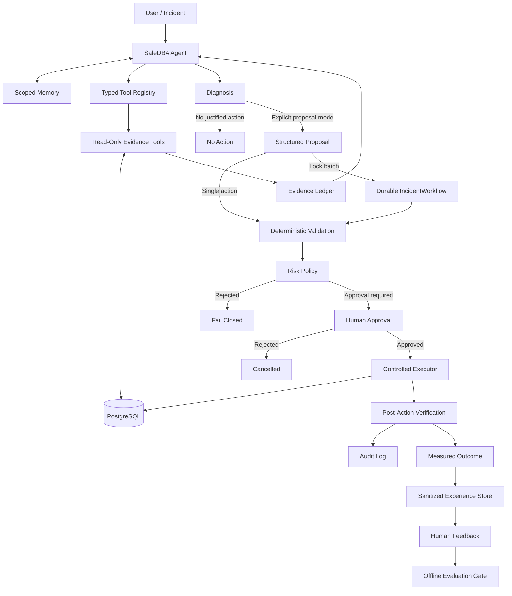

# SafeDBA

**Evidence-grounded, safety-aware Agentic DBA for PostgreSQL**

SafeDBA is an experimental database operations Agent that investigates
PostgreSQL performance and runtime incidents with live database evidence. The
language model can decide what to inspect and explain what it finds, while a
deterministic control plane owns validation, approval, execution, and
verification.

> **The model reasons about the incident. Deterministic code controls the
> database.**

SafeDBA is a research and portfolio project. It is not a production-ready
autonomous DBA and should not be connected to production systems without
additional isolation, observability, access control, and operational review.

---

## What SafeDBA Provides

- SQL performance diagnosis based on PostgreSQL plans and runtime metrics
- index, column, and statistics inspection
- general database health and session triage
- lock-wait graph analysis and blocker identification
- evidence-bound recommendations and structured action proposals
- deterministic risk classification and human approval gates
- controlled executors with post-action verification
- a durable multi-blocker lock-incident workflow
- scoped session and episodic memory
- sanitized experience capture and an offline evaluation/promotion workflow
- append-only local audit records with secret and query-text redaction

SafeDBA can currently prepare controlled proposals for:

| Operation | Risk | Execution condition |
|---|---:|---|
| Query rewrite evaluation | Low | Explicit proposal mode and evidence-bound validation |
| Create index | Medium | Explicit approval and measured post-action improvement |
| Analyze table | Medium | Explicit approval and statistics/cardinality verification |
| Terminate blocking backend | High | Exact identity binding, fresh lock evidence, and explicit approval |

Diagnosis is the default. A normal request does not authorize a proposal or a
database change.

---

## Architecture



The LLM never receives a raw database connection or direct execution
authority. All tool calls pass through typed schemas and deterministic policy.

---

## Agent Modes

### Diagnosis

The default mode exposes only evidence-gathering tools. Proposal tools are
removed from the model's available tool set and rejected if requested anyway.

```powershell
python src/main.py "Investigate why the database is slow. Diagnosis only."
```

### Explicit proposal

Proposal tools are available only when the operator explicitly asks for a
proposal. A proposal is still not approval to execute.

```powershell
python src/main.py --propose "Diagnose this query and propose a safe action if evidence justifies one."
```

### Durable lock remediation

The lock workflow converts the Agent's exact termination proposals into one
durable incident. Multiple independent blockers can be reviewed under one
approval and then processed serially.

```powershell
python src/main.py --resolve-locks "Resolve the current lock incident."
```

Each action receives a fresh complete lock observation before execution. A new
blocker, reused PID, changed transaction identity, or newly appearing waiter is
not silently added to the approved scope.

---

## Safety Model

SafeDBA uses several independent boundaries rather than relying on prompt
instructions alone.

### Evidence discipline

- factual database claims must cite tool evidence references such as
  `[ev-0001]`
- proposal prerequisites must come from a previous model turn
- query, table, column, index, and lock identities must match the evidence
- volatile observations expire and must be refreshed
- duplicate calls, tool-call budgets, output limits, and wall-clock deadlines
  bound the Agent loop
- incomplete, malformed, or failed Agent runs cannot reach controlled
  execution

### Query and database boundaries

- dynamic SQL is restricted to a conservative single-statement `SELECT`
  subset
- locking clauses, `SELECT INTO`, dangerous functions, malformed quoting, and
  multiple statements are rejected
- dynamic plans use PostgreSQL's extended protocol
- unfamiliar queries receive an estimated plan before bounded runtime analysis
- observer transactions are read-only and use statement, lock, and idle
  transaction timeouts
- estimated-cost and output-size gates limit expensive observations

### Separated runtime identities

The demo environment creates different PostgreSQL identities for:

- observation
- maintenance execution
- backend termination
- initial database bootstrap

SafeDBA attests the connected roles at runtime and fails before model use if
the identities are shared, privileged beyond policy, or incorrectly
configured.

### Approval and execution

Medium- and high-risk actions require explicit approval. Backend termination
is bound to the blocker PID, backend start, transaction start, original waiter
identities, database, backend type, and current lock relationship. These facts
are checked again at execution time.

The executor reports deterministic outcomes. An optional model review may
explain the result, but it cannot turn a rejected or inconclusive action into a
success.

### Audit and local state

Controlled actions are written to `logs/audit.jsonl`. Query text, credentials,
tokens, and sensitive statistics are redacted or fingerprinted by default.

Durable Agent, experience, and incident state is stored in local SQLite files
under `logs/`. These files are useful for development and recovery, but they
are not tamper-proof or WORM-compliant audit storage.

---

## IncidentWorkflow

`IncidentWorkflow` addresses lock incidents where several blockers need to be
handled as one operator-reviewed event.

It provides:

- one exact-scope approval for the complete observed batch
- deduplication when one blocker affects multiple waiters
- serial execution with a fresh lock graph before every action
- versioned SQLite checkpoints and compare-and-swap updates
- approval expiry and reapproval states
- execution leases for worker coordination
- conservative crash reconciliation
- fail-closed handling for ambiguous or in-doubt outcomes

The workflow does not treat an approval as permission to terminate any future
blocker. Scope expansion always requires a new incident and approval.

Useful commands:

```powershell
python src/main.py --incidents
python src/main.py --resume <incident-id>
```

---

## Memory and Improvement

SafeDBA separates conversational memory from action authorization.

### Memory

`logs/agent_state.sqlite3` stores bounded session turns, episodic summaries,
and versioned run-lifecycle checkpoints. A stable session can be supplied in
one-shot mode:

```powershell
python src/main.py --session demo-session --thread safedba-cli "Continue investigating the earlier incident."
```

Retrieved memory is inserted as untrusted historical context. It cannot
approve an action, satisfy a proposal prerequisite, or replace current
database evidence.

### Offline improvement loop

`logs/experience.sqlite3` stores sanitized run summaries. Operators may attach
explicit feedback, export reviewed records as a versioned JSONL dataset, and
assess a candidate against non-regression, safety, and human-approval gates.

```powershell
python src/learning_cli.py export `
  --version dba-eval-v1 `
  --purpose evaluation `
  --label good `
  --min-rating 4 `
  --output-directory datasets
```

This workflow does not train, deploy, or modify the running Agent. SafeDBA has
no online self-training or autonomous policy-replacement loop.

---

## Project Layout

```text
SafeDBA/
|-- src/
|   |-- main.py                  # CLI and workflow routing
|   |-- agent.py                 # Agent loop and evidence tools
|   |-- agent_policy.py          # Deterministic orchestration policy
|   |-- tool_registry.py         # Typed capability registry
|   |-- agent_memory.py          # Session, episode, and run persistence
|   |-- db_tools.py              # PostgreSQL observations and role checks
|   |-- query_guard.py           # Conservative SQL policy
|   |-- diagnostics.py           # Deterministic plan analysis
|   |-- actions.py               # Structured proposal builders
|   |-- executor.py              # Controlled action executors
|   |-- incident_workflow.py     # Multi-blocker state machine
|   |-- workflow_store.py        # Durable incident checkpoints
|   |-- incident_approval.py     # Exact-scope approval validation
|   |-- experience_store.py      # Sanitized feedback and dataset records
|   |-- learning_cli.py          # Offline export and promotion checks
|   |-- audit.py                 # Redacted append-only audit records
|   |-- config.py                # Environment configuration and bounds
|   `-- evaluate.py              # Regression evaluator
|-- tests/                       # Deterministic automated tests
|-- benchmarks/                  # Controlled regression cases and snapshots
|-- scripts/manual/              # Manual database integration checks
|-- sql/init.sql                 # Local PostgreSQL roles and demo fixtures
|-- docker-compose.yml
|-- .env.example
|-- requirements.txt
`-- README.md
```

---

## Getting Started

### Requirements

- Python 3.10 or newer
- Docker with Docker Compose
- an LLM API key

### Install

```powershell
git clone https://github.com/IsIllusion/SafeDBA.git
cd SafeDBA

python -m venv .venv
.\.venv\Scripts\Activate.ps1
python -m pip install -r requirements.txt

Copy-Item .env.example .env
```

Configure the provider in `.env`. For DeepSeek:

```dotenv
SAFEDBA_LLM_PROVIDER=deepseek
SAFEDBA_LLM_MODEL=deepseek-v4-flash
SAFEDBA_LLM_REASONING_ENABLED=false
DEEPSEEK_API_KEY=YOUR_API_KEY
```

Do not commit `.env`.

### Start the local database

```powershell
docker compose up -d
docker compose ps
```

The demo binds PostgreSQL to loopback and creates separate runtime roles. If an
older version of the project already initialized the Docker volume, the new
roles will not be recreated automatically. Recreate the volume only when the
local demo data is disposable:

```powershell
docker compose down -v
docker compose up -d
```

### Run SafeDBA

Interactive mode:

```powershell
python src/main.py
```

Common interactive commands:

```text
/propose <request>          allow proposals for this turn
/resolve-locks [context]    create one durable lock incident
/incidents                  list recent incidents
/resume <incident-id>       resume or reconcile an incident
/session                    display the current memory session
/session new                start a new session
/session <id>               switch to a named session
/forget                     delete the current session memory
/feedback good|bad [note]   record evaluation feedback
exit                        stop SafeDBA
```

---

## Testing and Evaluation

The automated suite covers Agent control flow, evidence policy, memory,
experience records, SQL safety, database-role attestation, proposal validation,
executors, IncidentWorkflow crash paths, audit redaction, and evaluator
behavior.

```powershell
python -m unittest discover -s tests -v
```

The current suite contains **189 tests** and can run without a live LLM or
PostgreSQL instance.

Manual integration scripts live in `scripts/manual/`. Some of them require a
running database, prepared concurrent sessions, credentials, and explicit
approval for controlled actions. Do not run those scripts against production.

The checked-in regression cases cover:

1. a selective predicate with a missing index
2. a non-sargable predicate with an existing supporting index
3. an appropriate sequential scan requiring no optimization
4. stale statistics causing a severe cardinality error

`benchmarks/results/latest_evaluation.json` is a historical pre-hardening
snapshot. It is retained for reference and is not evidence that the current
code has been re-evaluated against a real provider and database.

---

## Configuration

The complete configuration template is documented in `.env.example`.
Important groups include:

| Group | Purpose |
|---|---|
| `SAFEDBA_DB_*` | read-only observer connection and query limits |
| `SAFEDBA_EXECUTOR_DB_*` | maintenance executor identity |
| `SAFEDBA_TERMINATOR_DB_*` | isolated backend-termination identity |
| `SAFEDBA_LLM_*` | provider, model, reasoning, timeout, and token settings |
| `SAFEDBA_AGENT_*` | tool budgets, deadlines, evidence freshness, and memory |
| `SAFEDBA_INCIDENT_*` | workflow database, approval TTL, leases, and deadlines |
| `SAFEDBA_AUDIT_*` | audit path and query-text policy |

Configuration values are validated against safety bounds at startup.

---

## Important Limitations

- the SQL guard is a conservative lexer/policy, not a complete PostgreSQL AST
  parser
- `EXPLAIN ANALYZE` executes accepted read-only queries and cannot eliminate
  all workload risk
- cost estimates are not perfect predictors of runtime or resource use
- runtime observations are point-in-time snapshots
- rewrite comparison checks one database snapshot; it does not prove semantic
  equivalence for every possible state
- index creation is not yet a complete production-online index-management
  workflow
- backend termination has no application-level compensating rollback
- SQLite memory, workflow, and experience files need external backup,
  retention, and tamper protection in production
- one Python process still loads multiple database identities; a production
  design should isolate privileged capabilities into separate services
- the benchmark suite is too small to estimate general production accuracy
- the CLI has no multi-tenant RBAC, asynchronous approval service, or
  distributed tracing

Use SafeDBA only in isolated development or benchmark environments unless a
qualified operator has reviewed and strengthened every relevant control.

---

## Roadmap

- real PostgreSQL integration and failure-injection tests
- an AST-based PostgreSQL query policy
- durable reconciliation for ambiguous DDL outcomes
- production-safe online index workflows
- broader operational evidence and RCA tools
- holdout and adversarial evaluation suites
- OpenTelemetry-compatible model, tool, and workflow spans
- RBAC-backed asynchronous approvals
- provider routing and tested fallback policy
- generalized durable workflows beyond lock remediation
- continuous integration

---

## License

SafeDBA is available under the [MIT License](LICENSE).

## Disclaimer

SafeDBA is educational and experimental software. It is not a replacement for
professional database administration, production change management, incident
response procedures, backups, or independent security review.
