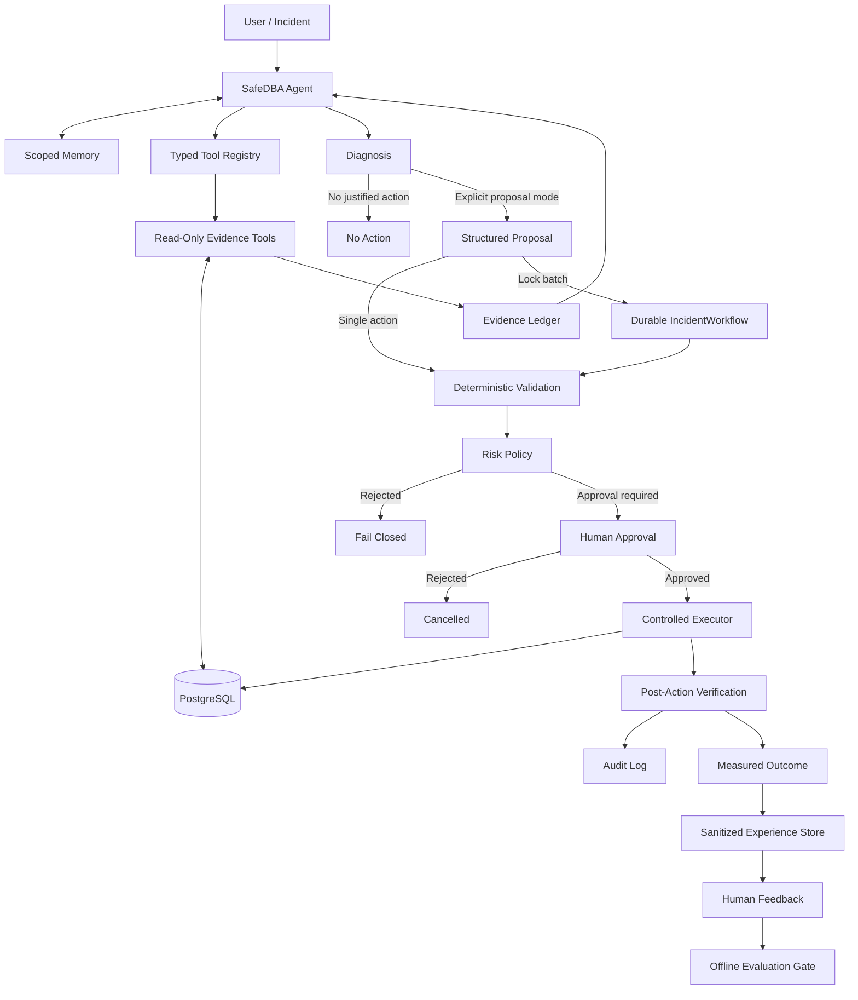

# SafeDBA

**Evidence-grounded, safety-aware Agentic DBA for PostgreSQL**

SafeDBA is an experimental database operations Agent that investigates
PostgreSQL performance and runtime incidents with live database evidence. The
language model can decide what to inspect and explain what it finds, while a
deterministic control plane owns validation, approval, execution, and
verification.

> **The model reasons about the incident. Deterministic code controls the
> database.**

SafeDBA is a research and portfolio project. It is not a production-ready
autonomous DBA and should not be connected to production systems without
additional isolation, observability, access control, and operational review.

## Current Status — 2026-09-05

The latest local verification passed 268 portable tests and 18 real PostgreSQL
integration tests. A separate real-provider smoke evaluation passed three
synthetic diagnosis cases using DeepSeek `deepseek-v4-flash` in eight requests.
These results establish a tested experimental baseline, not production
accuracy or a production deployment certification.

Independent lock execution is now available as an opt-in mode: the Agent
keeps observer/model credentials, and a separate worker keeps only observer
and termination credentials. Worker-side grants are short-lived, single-use,
and bound to the operator's reviewed scope. Separate OS accounts and ACLs
still need to be provisioned and tested by the deployer.

Documentation:

- [Independent executor: setup, approval and recovery](docs/ISOLATED_EXECUTOR.md)
- [Real-model evaluation: results, reproduction and limitations](docs/LIVE_MODEL_EVALUATION.md)
- [Change history](CHANGELOG.md)

---

## What SafeDBA Provides

- SQL performance diagnosis based on PostgreSQL plans and runtime metrics
- index, column, and statistics inspection
- single-call operational triage for sessions, connection capacity, VACUUM
  pressure, replication, and PostgreSQL-visible storage usage
- lock-wait graph analysis and blocker identification
- evidence-bound recommendations and structured action proposals
- deterministic risk classification and human approval gates
- controlled executors with post-action verification
- a durable multi-blocker lock-incident workflow
- scoped session and episodic memory
- sanitized experience capture and an offline evaluation/promotion workflow
- redacted local audit records with a verifiable append-only hash chain
- transient-error model circuit breaking with an optional explicit fallback
- environment-specific execution policy and deny-only live stop controls
- an opt-in independent lock executor with worker-private, short-lived grants
- bounded real-provider smoke evaluation against a disposable PostgreSQL instance

SafeDBA can currently prepare controlled proposals for:

| Operation | Risk | Execution condition |
|---|---:|---|
| Query rewrite evaluation | Low | Explicit proposal mode and evidence-bound validation |
| Create index | Medium | Explicit approval and measured post-action improvement |
| Analyze table | Medium | Explicit approval and statistics/cardinality verification |
| Terminate blocking backend | High | Exact identity binding, fresh lock evidence, and explicit approval |

Diagnosis is the default. A normal request does not authorize a proposal or a
database change.

Diagnosis mode and execution environment are separate controls. In development,
diagnosis can still execute an accepted query through `EXPLAIN ANALYZE`.
`SAFEDBA_ENV=production` blocks runtime query execution and the experimental
index/statistics/rewrite workflows; see [Runtime policy](#runtime-policy).

---

## Architecture



The LLM never receives a raw database connection or direct execution
authority. All tool calls pass through typed schemas and deterministic policy.
The diagram describes the logical workflow. In the default `combined` profile,
execution remains local. In the isolated profile, lock execution crosses the
authenticated loopback channel and the worker applies an additional private
grant gate before the same deterministic validation and execution path.

---

## Agent Modes

### Diagnosis

The default mode exposes only evidence-gathering tools. Proposal tools are
removed from the model's available tool set and rejected if requested anyway.

```powershell
python src/main.py "Investigate why the database is slow. Diagnosis only."
```

### Explicit proposal

Proposal tools are available only when the operator explicitly asks for a
proposal. A proposal is still not approval to execute.

```powershell
python src/main.py --propose "Diagnose this query and propose a safe action if evidence justifies one."
```

### Durable lock remediation

The lock workflow converts the Agent's exact termination proposals into one
durable incident. Multiple independent blockers can be reviewed under one
approval and then processed serially.

In isolated mode, the batch also needs an operator-side grant before workflow
execution. This is a separate approval boundary, not an approval for each PID.

```powershell
python src/main.py --resolve-locks "Resolve the current lock incident."
```

Each action receives a fresh complete lock observation before execution. A new
blocker, reused PID, changed transaction identity, or newly appearing waiter is
not silently added to the approved scope.

---

## Safety Model

SafeDBA uses several independent boundaries rather than relying on prompt
instructions alone.

### Evidence discipline

- factual database claims must cite tool evidence references such as
  `[ev-0001]`
- proposal prerequisites must come from a previous model turn
- query, table, column, index, and lock identities must match the evidence
- volatile observations expire and must be refreshed
- duplicate calls, tool-call budgets, output limits, and wall-clock deadlines
  bound the Agent loop
- incomplete, malformed, or failed Agent runs cannot reach controlled
  execution

### Query and database boundaries

- dynamic SQL is restricted to a conservative single-statement `SELECT`
  subset
- locking clauses, `SELECT INTO`, dangerous functions, malformed quoting, and
  multiple statements are rejected
- dynamic plans use PostgreSQL's extended protocol
- unfamiliar queries receive an estimated plan before bounded runtime analysis
- observer transactions are read-only and use statement, lock, and idle
  transaction timeouts
- estimated-cost and output-size gates limit expensive observations

### Separated runtime identities

The demo environment creates different PostgreSQL identities for:

- observation
- maintenance execution
- backend termination
- initial database bootstrap

SafeDBA attests the connected roles at runtime and fails before model use if
the identities are shared, privileged beyond policy, or incorrectly
configured.

### Approval and execution

Medium- and high-risk actions require explicit approval. Backend termination
is bound to the blocker PID, backend start, transaction start, original waiter
identities, database, backend type, and current lock relationship. These facts
are checked again at execution time.

The executor reports deterministic outcomes. An optional model review may
explain the result, but it cannot turn a rejected or inconclusive action into a
success.

### Audit and local state

Controlled actions are written to `logs/audit.jsonl`. Query text, credentials,
tokens, and sensitive statistics are redacted or fingerprinted by default.
Every new record carries a sequence number, previous-record digest, and its
own digest. SafeDBA validates the complete retained chain before appending and
fails closed if a chained record was modified, reordered, inserted, or removed
from the middle of the retained history.

```powershell
python src/main.py --verify-audit
```

Existing unchained logs are preserved and their final legacy record becomes a
SHA-256 migration anchor. This detects later changes to the chained portion;
it does not retroactively protect all earlier legacy records.

Readers and writers use the same OS-managed local lock. A long-running writer
cannot lose its lock just because a timestamp is old; process exit releases
the lock automatically. The `.lock` sidecar remains on disk and must not be
deleted while workers are running. Stop all old-version workers before upgrading
from the previous age-based lock implementation. This is a local-filesystem
guarantee, not distributed locking across hosts or arbitrary network shares.
Duplicate JSON keys, non-finite numbers, malformed chain envelopes, and
unterminated final lines are rejected. Preserve damaged logs for investigation;
SafeDBA never silently truncates or repairs them.

Durable Agent, experience, and incident state is stored in local SQLite files
under `logs/`. These files are useful for development and recovery, but they
are not WORM-compliant audit storage.

---

## IncidentWorkflow

`IncidentWorkflow` addresses lock incidents where several blockers need to be
handled as one operator-reviewed event.

It provides:

- one exact-scope approval for the complete observed batch
- deduplication when one blocker affects multiple waiters
- serial execution with a fresh lock graph before every action
- versioned SQLite checkpoints and compare-and-swap updates
- approval expiry and reapproval states
- execution leases for worker coordination
- conservative crash reconciliation
- fail-closed handling for ambiguous or in-doubt outcomes

The workflow does not treat an approval as permission to terminate any future
blocker. Scope expansion always requires a new incident and approval.

Useful commands:

```powershell
python src/main.py --incidents
python src/main.py --resume <incident-id>
```

---

## Memory and Improvement

SafeDBA separates conversational memory from action authorization.

### Memory

`logs/agent_state.sqlite3` stores bounded session turns, episodic summaries,
and versioned run-lifecycle checkpoints. A stable session can be supplied in
one-shot mode:

```powershell
python src/main.py --session demo-session --thread safedba-cli "Continue investigating the earlier incident."
```

Retrieved memory is inserted as untrusted historical context. It cannot
approve an action, satisfy a proposal prerequisite, or replace current
database evidence.

### Offline improvement loop

`logs/experience.sqlite3` stores sanitized run summaries. Operators may attach
explicit feedback, export reviewed records as a versioned JSONL dataset, and
assess a candidate against non-regression, safety, and human-approval gates.

```powershell
python src/learning_cli.py export `
  --version dba-eval-v1 `
  --purpose evaluation `
  --label good `
  --min-rating 4 `
  --output-directory datasets
```

This workflow does not train, deploy, or modify the running Agent. SafeDBA has
no online self-training or autonomous policy-replacement loop.

---

## Project Layout

```text
SafeDBA/
|-- src/
|   |-- main.py                  # CLI and workflow routing
|   |-- agent.py                 # Agent loop and evidence tools
|   |-- agent_policy.py          # Deterministic orchestration policy
|   |-- tool_registry.py         # Typed capability registry
|   |-- agent_memory.py          # Session, episode, and run persistence
|   |-- db_tools.py              # PostgreSQL observations and role checks
|   |-- query_guard.py           # Conservative SQL policy
|   |-- diagnostics.py           # Deterministic plan analysis
|   |-- actions.py               # Structured proposal builders
|   |-- executor.py              # Controlled action executors
|   |-- execution_client.py      # Reference-only, no-retry worker client
|   |-- execution_protocol.py    # Bounded and strict execution messages
|   |-- execution_grants.py      # Worker-private, single-use action grants
|   |-- executor_worker.py       # Independent lock worker and operator CLI
|   |-- incident_workflow.py     # Multi-blocker state machine
|   |-- workflow_store.py        # Durable incident checkpoints
|   |-- incident_approval.py     # Exact-scope approval validation
|   |-- experience_store.py      # Sanitized feedback and dataset records
|   |-- learning_cli.py          # Offline export and promotion checks
|   |-- audit.py                 # Redacted, hash-chained audit records
|   |-- runtime_policy.py        # Environment gates and live stop controls
|   |-- telemetry.py             # Optional metadata-only tracing
|   |-- integration_guard.py     # Disposable database identity checks
|   |-- live_evaluate.py         # Bounded real-provider smoke evaluation
|   |-- config.py                # Environment configuration and bounds
|   `-- evaluate.py              # Regression evaluator
|-- tests/                       # Unit and protocol tests
|   |-- integration/             # Opt-in real PostgreSQL scenarios
|   `-- fixtures/                # Dedicated disposable database fixture
|-- docs/                        # Executor deployment and evaluation details
|-- benchmarks/                  # Controlled regression cases and snapshots
|-- scripts/
|   |-- run_postgres_integration.py # Disposable cluster/test orchestration
|   `-- manual/                  # Legacy manual database integration checks
|-- .github/workflows/ci.yml      # Portable tests and PostgreSQL 16/18 jobs
|-- sql/init.sql                 # Local PostgreSQL roles and demo fixtures
|-- docker-compose.yml
|-- .env.example
|-- requirements.txt
|-- CHANGELOG.md
`-- README.md
```

---

## Getting Started

### Requirements

- Python 3.10 or newer
- Docker with Docker Compose for the demo database, or installed PostgreSQL
  binaries for the disposable integration runner
- an LLM API key

### Install

```powershell
git clone https://github.com/IsIllusion/SafeDBA.git
cd SafeDBA

python -m venv .venv
.\.venv\Scripts\Activate.ps1
python -m pip install -r requirements.txt

Copy-Item .env.example .env
```

Configure the provider in `.env`. For DeepSeek:

```dotenv
SAFEDBA_LLM_PROVIDER=deepseek
SAFEDBA_LLM_MODEL=deepseek-v4-flash
SAFEDBA_LLM_REASONING_ENABLED=false
DEEPSEEK_API_KEY=YOUR_API_KEY
```

Do not commit `.env`.

### Start the local database

```powershell
docker compose up -d
docker compose ps
```

The demo binds PostgreSQL to loopback and creates separate runtime roles. If an
older version of the project already initialized the Docker volume, the new
roles will not be recreated automatically. Recreate the volume only when the
local demo data is disposable:

```powershell
docker compose down -v
docker compose up -d
```

### Run SafeDBA

Interactive mode:

```powershell
python src/main.py
```

Common interactive commands:

```text
/propose <request>          allow proposals for this turn
/resolve-locks [context]    create one durable lock incident
/incidents                  list recent incidents
/resume <incident-id>       resume or reconcile an incident
/session                    display the current memory session
/session new                start a new session
/session <id>               switch to a named session
/forget                     delete the current session memory
/feedback good|bad [note]   record evaluation feedback
exit                        stop SafeDBA
```

---

## Testing and Evaluation

The automated suite covers Agent control flow, evidence policy, memory,
experience records, SQL safety, database-role attestation, proposal validation,
executors, IncidentWorkflow crash paths, audit redaction and integrity, and
evaluator behavior.

```powershell
python -m unittest discover -s tests -v
```

The suite currently discovers **286 tests**: 268 portable unit and protocol
tests plus 18 live PostgreSQL integration tests. Without a database, the live
tests skip automatically; no test requires a live LLM.

The suite includes cross-process audit contention/crash recovery, production
policy bypass attempts, live stop controls, and interrupted-batch reapproval.

GitHub Actions is configured to run the portable suite on Windows and Linux,
with Python 3.10 and 3.12. Separate integration jobs are configured for
PostgreSQL 16 and 18. They create a lightweight least-privilege fixture and
publish machine-readable results. The real database tests cover:

- role attestation, observer write rejection, plans, snapshots and timeouts;
- three real blockers resolved under one approval, and completed-step replay;
- denied approval, stale transaction identity and corrupt-audit refusals;
- stopping between actions and obtaining fresh approval on resume;
- lost workflow results after a real termination, without repeating the action;
- catalog-identity-bound index cleanup;
- a scripted Agent calling real evidence tools without executing proposals;
- a separate Agent process without privileged DB passwords resolving three
  locks through a worker, missing/tampered grant refusals, and worker exit
  after a real effect without automatic replay.

To run locally using installed PostgreSQL binaries:

```powershell
python scripts/run_postgres_integration.py --pg-bin "C:\Program Files\PostgreSQL\18\bin" --repeat 3
```

This runner creates a **new disposable cluster**, listens only on `127.0.0.1`
with a dynamically selected port, and ignores `.env` and inherited PostgreSQL
connection settings. It does not install software, use existing databases,
or make paid model calls by default. On Unix, provide the installed PostgreSQL
bin directory or put its binaries on PATH, and run as a non-root user. PostgreSQL
`initdb` may need to run outside restricted Windows process-token sandboxes.

Tests verify a per-instance UUID in a bootstrap-owned control schema before
performing integration scenarios. A missing, mismatched or executor-owned
marker fails closed. The runner stops its server before removing its temporary
cluster; if stopping fails, it retains the cluster and marks the run failed.
Reports and logs remain under `logs/integration-runs/<run-id>/`, including
source fingerprint, engine/Python versions, per-test outcomes and timings,
skipped-test counts, and cleanup status. `run_suite.py` returns a failure for
empty or skipped integration suites, not a misleading successful exit.

For an independently provisioned disposable CI database, initialize
`tests/fixtures/postgres_integration.sql`, configure the three dedicated
connections, and set `SAFEDBA_TEST_INSTANCE_ID` to the UUID queried from
`safedba_test_control.instance`, in addition to `SAFEDBA_RUN_POSTGRES_INTEGRATION=1`.
See `.github/workflows/ci.yml` for the exact setup. Never add the test marker
to a business database to bypass these checks.

These tests establish deterministic control-flow and database-boundary
regression evidence, **not live-model diagnostic accuracy**. The scripted
provider is explicitly labelled, and reports record `live_llm_used: false`.
Independent holdouts, distributed failure injection, and load/soak testing
are still separate work.

### Bounded real-model evaluation

```powershell
python scripts/run_postgres_integration.py --pg-bin "C:\Program Files\PostgreSQL\18\bin" --live-model-eval
```

This explicit opt-in first runs the deterministic integration suite. Only if
it passes does the runner use the configured primary model for three synthetic
diagnosis cases: connection/lock triage, an estimated plan, and actual lock
root cause. It reads only model settings from `.env`; all database endpoints
and credentials come from the newly created disposable fixture. The Agent
child uses the observer-only profile and production deny policies. It receives
no mutation passwords, uses no memory/training, and cannot execute the test
query or remediate the synthetic lock. Only generated test evidence goes to
the provider, not business data or configuration contents.

Limits are 12 requests total, 4 turns per case, 1,024 maximum completion tokens
and 180,000 input characters per request. SDK retries, thinking and fallback
are disabled; a provider failure stops further calls. These are request/token
bounds, not a guaranteed monetary price. Reports retain model identity, actual
usage, per-case checks, sanitized answers and tool traces in `live-model.json`.

The 2026-09-05 DeepSeek `deepseek-v4-flash` baseline passed all three automatic
checks in 8 requests (60,174 reported tokens). This is a **three-case smoke
result, not 100% diagnostic accuracy**. Manual review found verbosity,
language inconsistency, and overly broad health wording. See the
[baseline and interpretation](docs/LIVE_MODEL_EVALUATION.md).

Manual integration scripts live in `scripts/manual/`. Some of them require a
running database, prepared concurrent sessions, credentials, and explicit
approval for controlled actions. Do not run those scripts against production.

The checked-in regression cases cover:

1. a selective predicate with a missing index
2. a non-sargable predicate with an existing supporting index
3. an appropriate sequential scan requiring no optimization
4. stale statistics causing a severe cardinality error

`benchmarks/results/latest_evaluation.json` is a historical pre-hardening
snapshot. It is retained for reference and is not evidence that the current
code has been re-evaluated against a real provider and database.

---

## Configuration

The complete configuration template is documented in `.env.example`.
Important groups include:

| Group | Purpose |
|---|---|
| `SAFEDBA_DB_*` | read-only observer connection and query limits |
| `SAFEDBA_EXECUTOR_DB_*` | maintenance executor identity |
| `SAFEDBA_TERMINATOR_DB_*` | isolated backend-termination identity |
| `SAFEDBA_LLM_*` | provider, model, reasoning, timeout, and token settings |
| `SAFEDBA_AGENT_*` | tool budgets, deadlines, evidence freshness, and memory |
| `SAFEDBA_INCIDENT_*` | workflow database, approval TTL, leases, and deadlines |
| `SAFEDBA_AUDIT_*` | audit path and query-text policy |
| `SAFEDBA_OTEL_*` | optional OTLP/HTTP tracing endpoint, service name, and timeout |
| `SAFEDBA_ENV`, `SAFEDBA_ENABLE_*`, `SAFEDBA_ALLOW_*` | startup execution privilege ceiling |
| `SAFEDBA_RUNTIME_CONTROLS_*` | trusted, reloadable deny-only stop controls |
| `SAFEDBA_PROCESS_ROLE`, `SAFEDBA_EXECUTOR_URL`, `SAFEDBA_EXECUTOR_API_TOKEN` | opt-in process separation and loopback submission |
| `SAFEDBA_EXECUTION_GRANT_DB_PATH` | worker-private operator grants, never Agent-writable |

Configuration values are validated against safety bounds at startup.
`SAFEDBA_SKIP_DOTENV=1` explicitly disables loading the local `.env` file;
the disposable test runner uses this to prevent development settings from
leaking into isolated evaluation processes.

### Independent lock executor

`SAFEDBA_PROCESS_ROLE=agent` loads only the observer password and model key;
`SAFEDBA_PROCESS_ROLE=executor` loads observer/termination credentials and
rejects model and maintenance passwords. Neither isolated profile loads
`.env`. They must be launched with separately populated process environments.
The default `combined` profile preserves local development behavior.

An Agent request contains only incident/action/operation references and a
proposal digest. The worker re-reads configured durable state, consumes an
operator-side exact-scope grant, checks TTL/lease/fresh evidence, and invokes
the existing deterministic executor. It cannot accept arbitrary SQL or DSNs.
Lost or malformed responses are not retried; uncertain actions require review.

One operator batch grant **plus** one existing workflow confirmation can cover
multiple blockers. This adds a separate trust boundary, not per-blocker
prompts. It currently supports lock termination only. See
[configuration, trust boundary and recovery](docs/ISOLATED_EXECUTOR.md).

Subprocess separation is tested; OS isolation is **not automatically
installed**. Use distinct service identities and protect worker secrets,
grant storage, deployed code and controls with ACLs. Two processes under the
same unrestricted account are not a security sandbox.

### Runtime policy

| Environment | Catalogs / estimated plans | Runtime EXPLAIN | Repeated benchmarks | Mutations |
|---|---|---|---|---|
| `development`, `benchmark` | Available | Available by default | Available by default | Existing approval gates |
| `staging` | Available | Available by default | Explicit opt-in | Index/statistics experiments also require benchmark opt-in |
| `production` | Available | Prohibited | Prohibited | Disabled by default; only lock termination can be explicitly enabled |

Production always blocks `CREATE_INDEX`, `ANALYZE_TABLE`, `REWRITE_QUERY`,
rollback `DROP_INDEX`, and query-result comparison. The existing workflows
measure workloads and are not online production deployment workflows.
Deliberate production lock termination requires both
`SAFEDBA_ENABLE_MUTATIONS=true` and `SAFEDBA_ENABLE_TERMINATE_BACKEND=true`;
this never replaces evidence binding, human approval, or final identity checks.
Individual `SAFEDBA_ENABLE_<ACTION_TYPE>` flags can further restrict execution.
Benchmark requests reject non-integer, negative, empty, or more than 20 total
warmup/sample executions. Existing SQL timeouts and Agent budgets still apply.

Inspect effective policy without running a model or database action:

```powershell
python src/runtime_policy.py
# Equivalent through the main CLI:
python src/main.py --runtime-policy
```

An operator-owned JSON file at `SAFEDBA_RUNTIME_CONTROLS_PATH` can restrict
running processes without restarting them. The default path is
`logs/runtime_controls.json`, resolved relative to the project root. Example:

```json
{
  "version": 1,
  "disable_agent": false,
  "disable_mutations": true,
  "disable_runtime_analysis": false,
  "disable_benchmarks": true,
  "disabled_actions": ["TERMINATE_BACKEND"]
}
```

Set `disable_agent` to stop subsequent model turns and database-tool dispatches.
Controls are checked again at execution boundaries and between benchmark
samples. They cannot grant permissions denied at startup. Unknown keys,
duplicate keys, wrong types, unreadable files, and oversized files fail closed.
Use UTF-8 without BOM and atomically replace the file on the same filesystem;
a partially written file deliberately blocks new operations. Protect its
directory using OS permissions and keep it outside untrusted tool access.

For deployments, set `SAFEDBA_RUNTIME_CONTROLS_REQUIRED=true` after provisioning
the file: a missing/deleted file then blocks operations. With the default
`false`, absence means no additional live restrictions and restores the startup
ceiling. Changing `.env` alone does not update a running process.

These are cooperative stop controls, not cancellation of already-issued SQL
or an in-flight provider request (including that request's retries/fallback),
or a security boundary against a process that can edit its own code/config.
If the policy blocks an incident step before its execution claim, the pending
steps return to fresh approval; completed steps are not repeated on resume.
If a claim or side effect may already have happened, the existing reconciliation
and manual-review rules remain. Stop controls also apply to rollback mutations:
if cleanup is blocked, inspect the retained state before performing manual
recovery. Removing a stop does not automatically resume a workflow.

### Model resilience

Each configured model route has a circuit breaker. It counts only final
transient failures after the provider client's own retry policy is exhausted:
connection failures, timeouts, rate limits, HTTP 408, and HTTP 5xx responses.
Authentication, permission, malformed-request, and local adapter errors fail
immediately and never trigger automatic fallback.

The fallback route is disabled by default and requires an explicit provider,
model, endpoint when required, and a separate API key. Successful and failed
Agent results record the selected provider/model, circuit state, and failover
reason without recording credentials or provider error messages.

### Observability

OpenTelemetry tracing is disabled by default. When enabled, Agent runs
correlate runtime security attestation, model requests, and tool calls. Durable
lock-workflow passes correlate approval, fresh observations, deterministic
execution, and post-action verification. Both returned results include their
trace ID. The exporter uses OTLP over HTTP and is intended to point at an
OpenTelemetry Collector.

Span attributes contain bounded operational metadata only. SafeDBA does not
attach prompts, SQL, tool arguments/results, credentials, thread IDs, or
session IDs to spans. Existing structured `model_trace`, `tool_trace`, and
audit records remain available for local inspection.

---

## Important Limitations

- the SQL guard is a conservative lexer/policy, not a complete PostgreSQL AST
  parser
- `EXPLAIN ANALYZE` executes accepted read-only queries and cannot eliminate
  all workload risk
- cost estimates are not perfect predictors of runtime or resource use
- runtime observations are point-in-time snapshots
- rewrite comparison checks one database snapshot; it does not prove semantic
  equivalence for every possible state
- index creation is not yet a complete production-online index-management
  workflow
- backend termination has no application-level compensating rollback
- SQLite memory, workflow, and experience files need external backup,
  retention, and tamper protection in production
- the local audit hash chain detects retained-chain corruption but cannot
  prevent whole-file deletion, tail truncation, or privileged local tampering;
  production still needs externally anchored or WORM audit storage
- default combined mode still loads multiple DB identities; the independent
  lock worker is opt-in and requires separate-account/ACL deployment testing
- the benchmark suite is too small to estimate general production accuracy
- the CLI has no multi-tenant RBAC or asynchronous approval service
- fallback models can produce materially different reasoning and must be
  evaluated against the same safety and regression suites before enablement

Use SafeDBA only in isolated development or benchmark environments unless a
qualified operator has reviewed and strengthened every relevant control.

---

## Roadmap

- separate-account/container deployment and OS isolation verification
- authenticated operator approval and clearer in-doubt result reconciliation
- broader PostgreSQL failure injection (disconnects, failover, disk pressure)
- an AST-based PostgreSQL query policy
- durable reconciliation for ambiguous DDL outcomes
- production-safe online index workflows
- broader operational evidence and RCA tools
- holdout and adversarial evaluation suites
- RBAC-backed asynchronous approvals
- generalized durable workflows beyond lock remediation
- sustained multi-version PostgreSQL CI and load/soak testing

---

## License

SafeDBA is available under the [MIT License](LICENSE).

## Disclaimer

SafeDBA is educational and experimental software. It is not a replacement for
professional database administration, production change management, incident
response procedures, backups, or independent security review.
