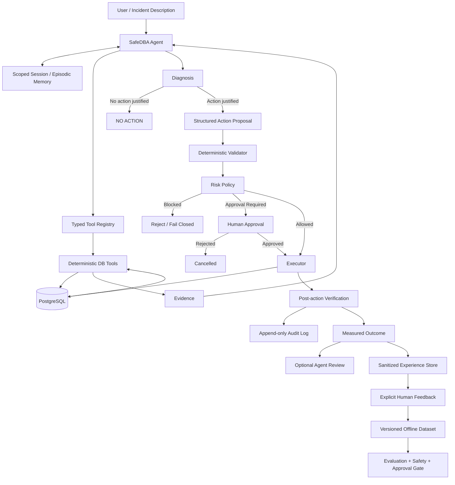

# SafeDBA

**Evidence-grounded, safety-aware Agentic DBA for PostgreSQL**

SafeDBA is an experimental Agentic Database Administration system that
investigates PostgreSQL performance and operational incidents using
real database evidence, while keeping database modification authority
outside the LLM.

The core design principle is:

> **The LLM decides what to investigate. Deterministic tools establish
> facts. A deterministic safety layer owns execution authority.**

SafeDBA is currently designed as a portfolio / research prototype rather
than a production-ready autonomous DBA.

---

## Current System Snapshot

The repository now contains a complete safety-oriented Agent control plane,
not only a prompt wrapped around database utilities.

| Area | Current implementation |
|---|---|
| Agent loop | Diagnosis and explicit-proposal modes, typed tool calls, evidence references, duplicate-call suppression, per-turn/total budgets, deadlines, and bounded tool output |
| PostgreSQL evidence | Cost-gated plans, bounded `EXPLAIN ANALYZE`, index and column metadata, statistics health, active sessions, transactions, database health, and lock graphs |
| Deterministic safety | SQL lexer/guard, strict proposal validation, separated observer/executor/terminator roles, runtime role attestation, risk policy, approval gates, rollback paths, and post-action verification |
| Multi-action incidents | Durable `IncidentWorkflow` batches multiple lock blockers into one exact-scope approval, executes serially with fresh evidence, and persists versioned checkpoints for safe resume/reconciliation |
| Memory | SQLite-backed run lifecycle, scoped session turns, episodic retrieval, retention controls, provenance, and secret redaction; remembered content is treated as untrusted historical context |
| Improvement loop | Sanitized experience capture, explicit human feedback, versioned dataset export, evaluation comparison, and an audited promotion gate; there is no online self-training or autonomous policy modification |
| MCP | Local stdio server with 13 read-only/diagnosis tools, two resources, and two prompts; proposal, approval, resume, and executor capabilities are deliberately not exposed |
| Evaluation | Deterministic safety, Agent, memory, workflow, executor, MCP, and regression behavior are covered by 189 automated tests |

In practical terms, SafeDBA can investigate a database, explain its evidence,
remember scoped operational context, prepare tightly bound proposals, and run a
durable approved lock-remediation batch. The LLM still cannot grant itself new
permissions, directly execute SQL mutations, approve its own actions, or train
and deploy a replacement policy.

---

## Why SafeDBA?

LLMs can reason about SQL and database operations, but directly giving
a generative model unrestricted database authority creates obvious
reliability and safety problems.

SafeDBA separates reasoning from execution:

```text
Natural-language incident
        |
        v
LLM investigation routing
        |
        v
Deterministic PostgreSQL evidence tools
        |
        v
Evidence-grounded diagnosis
        |
        v
Structured action proposal
        |
        v
Deterministic validation + risk policy
        |
        v
Human approval when required
        |
        v
Controlled executor
        |
        v
Post-action verification
        |
        v
Append-only audit log
```

The Agent can investigate and recommend actions, but it does not have
direct authority to modify the database.

---

## Architecture



---


## Demo Scenarios

SafeDBA is designed to distinguish between situations that require
optimization, situations that require maintenance, and situations where
the safest decision is to take no action.

The following scenarios illustrate that behavior.

### Demo 1 — Correctly Refusing an Unnecessary Optimization

**Incident**

```sql
SELECT *
FROM orders
WHERE id > 0;
```

PostgreSQL chooses a Sequential Scan even though the table already has
a primary-key B-tree index on `id`.

A naive SQL-optimization agent might treat the Sequential Scan itself as
a problem and recommend another index.

SafeDBA instead collects execution evidence:

```text
Scan type:            Sequential Scan
Rows examined:        1,000,000
Rows returned:        1,000,000
Rows removed:         0
Selectivity:          1.0
Cardinality error:    1.0
```

Because the query returns effectively the entire table, the Sequential
Scan is appropriate.

SafeDBA therefore produces:

```text
Diagnosis:
The predicate is non-selective and the Sequential Scan is appropriate.

Action:
NO_ACTION
```

No index, rewrite, or statistics-maintenance proposal is submitted.

This scenario is included in the regression benchmark. The checked-in result
showing three passing runs is a pre-hardening historical snapshot and has not
been rerun against the current code.

---

### Demo 2 — Stale Statistics Instead of a Missing Index

**Incident**

```sql
SELECT *
FROM cardinality_test
WHERE status = 'hot';
```

Runtime evidence shows:

```text
Rows examined:               100,000
Rows returned:                50,000
Planner estimated rows:            1
Cardinality error ratio:      50,000x
Predicate selectivity:             0.5
```

The query uses a Sequential Scan, but the scan itself is not the main
problem: returning 50% of the table makes a Sequential Scan reasonable.

SafeDBA inspects PostgreSQL statistics and finds that the planner
statistics describe a distribution that no longer matches the observed
data.

The resulting diagnosis is:

```text
Root cause:
Severely stale planner statistics.

Rejected alternatives:
CREATE_INDEX
REWRITE_QUERY

Structured proposal:
ANALYZE_TABLE
```

The expected outcome is improved cardinality estimation, not
necessarily a different scan type or lower latency.

This distinction matters because SafeDBA evaluates the operation against
an action-specific acceptance criterion instead of assuming that every
database intervention must make the query faster.

The checked-in result showing three passing runs for this scenario is likewise
a pre-hardening historical snapshot, not a current validation result.

---

### Demo 3 — Lock Contention RCA with Controlled Remediation

SafeDBA can also investigate operational incidents without starting from
a predefined SQL optimization case.

For a PostgreSQL blocking scenario, the Agent can collect deterministic
runtime evidence such as:

```text
blocked backend
        |
        | pg_blocking_pids()
        v
blocking backend

+ session state
+ wait event
+ transaction age
+ blocked SQL
+ blocker SQL
+ waiting-lock evidence
```

A typical diagnosis may identify an idle-in-transaction client backend
that is currently blocking another backend waiting on a lock.

SafeDBA does not give the LLM direct permission to terminate that
session.

Instead, remediation follows this path:

```text
Agent investigation
        |
        v
Current lock evidence
        |
        v
Structured TERMINATE_BACKEND proposal
        |
        v
Deterministic validation
        |
        v
HIGH-risk classification
        |
        v
Human approval
        |
        v
Execution-time revalidation
        |
        v
pg_terminate_backend(...)
        |
        v
Post-action lock verification
        |
        v
Append-only audit record
```

The executor rechecks that the blocking relationship still exists before
attempting termination. This reduces the risk of acting on stale Agent
evidence.

After execution, SafeDBA verifies whether the original blocking
relationship has disappeared rather than treating a successful API call
as proof that the incident was resolved.

Backend termination remains a deliberately narrow, human-approved,
HIGH-risk operation.

#### Durable Multi-Blocker IncidentWorkflow

An explicit `/resolve-locks` request creates one durable lock incident rather
than sending each proposed termination directly to the ordinary executor. The
same mode is available to one-shot callers as `--resolve-locks`.

Within the exact scope observed for that incident:

- independent blocker backends become separate actions
- one blocker shared by several original waiters is deduplicated into one
  action whose approved scope records each waiter's PID, backend start, and
  transaction start identity
- the complete batch is shown to the operator once and receives one explicit
  HIGH-risk approval
- actions run serially, with a fresh complete lock-graph observation before
  each action, executor-level final revalidation, and post-action verification
- workflow and action checkpoints are stored in SQLite, so `/resume <id>` or
  `--resume <id>` can continue or conservatively reconcile an interrupted
  incident; resume first reruns the database-role security attestation

This is an exact-scope approval, not permission to terminate whatever becomes
blocked later. A newly observed blocker identity is reported but never added to
the approved batch automatically; it requires a new incident and approval.
Likewise, `/resolve-locks` fails closed if the Agent returns no proposal,
malformed output, or any proposal other than `TERMINATE_BACKEND`. Such output
never falls through to the ordinary executor.

> This lock-contention flow is currently exercised through manual
> integration / end-to-end verification scripts and is not part of the
> four-scenario automated regression benchmark above.

---

### What These Scenarios Demonstrate

The goal is not simply to make an LLM produce DBA recommendations.

The scenarios exercise three different decisions:

| Scenario | Correct System Behavior |
|---|---|
| Broad predicate / correct Seq Scan | Refuse unnecessary optimization |
| Severe stale-statistics error | Propose targeted statistics maintenance |
| Runtime lock contention | Perform RCA and gate remediation behind safety controls |

Together they demonstrate the separation between:

```text
probabilistic investigation
        and
deterministic execution authority
```


## Core Capabilities

### 1. SQL Performance Diagnosis

SafeDBA can inspect read-only PostgreSQL queries using deterministic
execution-plan evidence.

Current diagnostic capabilities include:

- Sequential Scan analysis
- Index usage inspection
- Selectivity analysis
- Rows examined vs. rows returned
- PostgreSQL buffer evidence
- Cardinality-estimation error
- Parallel scan handling
- Missing-index diagnosis
- Non-sargable predicate detection
- Statistics-related planner anomalies

SafeDBA does **not** assume that every Sequential Scan is a problem.

For example, a full-table query with very low filtering selectivity may
correctly use a Sequential Scan even when an index exists.

---

### 2. Query Rewrite Evaluation

SafeDBA may propose a SQL rewrite when database evidence indicates that
a non-sargable predicate prevents effective index use.

A proposed rewrite is not automatically considered correct.

The deterministic executor can validate:

1. result-set equivalence
2. execution behavior
3. measured performance

before treating the rewrite hypothesis as supported.

---

### 3. Statistics and Cardinality Diagnosis

SafeDBA can investigate severe PostgreSQL planner-estimation errors and
inspect column/table statistics.

When stale or insufficient statistics are strongly supported by
evidence, the Agent may propose an `ANALYZE_TABLE` action.

The effect of `ANALYZE` is verified using planner-estimation evidence;
it is not assumed that scan type or latency must improve.

---

### 4. General Incident Mode

SafeDBA also accepts operational descriptions without requiring the
user to provide a specific SQL statement.

Example:

```text
The database feels slow and some work may be stuck.
Investigate using current database evidence.
Diagnosis only.
```

The Agent can route its investigation through runtime evidence such as:

- database health snapshot
- active client sessions
- long-running queries
- open / idle transactions
- lock waits
- blocked-to-blocker relationships

This allows SafeDBA to move beyond SQL optimization into database
operations RCA.

---

### 5. Lock Contention RCA

SafeDBA can use PostgreSQL runtime state to identify:

- blocked backend PID
- blocker backend PID
- blocked SQL
- blocker SQL
- wait event
- transaction age
- session state
- waiting lock evidence

The system distinguishes deterministic evidence from inference.

For example:

- `ClientRead` on an idle-in-transaction blocker means the backend is
  waiting for client activity.
- It does not mean the blocker itself is waiting on a database lock.
- A point-in-time blocking snapshot is not automatically described as
  a deadlock.
- Lock ownership is not claimed unless deterministic evidence supports
  that ownership.

---

## Controlled Remediation

SafeDBA separates action proposals from execution.

Current action types include:

```text
CREATE_INDEX
REWRITE_QUERY
ANALYZE_TABLE
TERMINATE_BACKEND
```

Each proposal passes through deterministic validation before execution.

---

## Safety Model

SafeDBA treats database operations according to explicit risk policy.

Examples:

| Operation | Risk |
|---|---|
| estimated EXPLAIN / observations | LOW |
| bounded EXPLAIN ANALYZE observation | LOW |
| REWRITE_QUERY | LOW |
| CREATE_INDEX | MEDIUM |
| ANALYZE_TABLE | MEDIUM |
| TERMINATE_BACKEND | HIGH |
| DROP_TABLE | CRITICAL |

Unknown operations fail closed as `CRITICAL`.

Medium- and high-risk actions require explicit approval according to the
current policy.

The security boundary is enforced in layers:

- a single-statement query policy rejects locking clauses, `SELECT INTO`,
  dangerous PostgreSQL functions, comments/quoting tricks, and oversized SQL
- PostgreSQL's extended protocol is forced for dynamic EXPLAIN input, so the
  server parser also enforces one statement even if the client policy has a bug
- unfamiliar queries are inspected with plain `EXPLAIN` before any bounded
  `EXPLAIN ANALYZE`
- every observation transaction is `READ ONLY` and has statement, lock, and
  idle-transaction timeouts
- observer, maintenance executor, session terminator, and bootstrap
  identities are separate PostgreSQL roles
- the demo revokes public database/schema creation, temporary objects, and
  execution of user-defined functions in the application schema
- the Docker demo binds PostgreSQL to loopback only; runtime code never uses
  the bootstrap superuser
- a startup attestation checks the real connected roles and fails before the
  LLM is called if identities are shared, privileged, or not actually read-only

The SQL policy is a defense-in-depth filter, not a replacement for PostgreSQL
role permissions and read-only transactions.

### Agent Control Plane

The model cannot authorize its own proposal. The deterministic control plane
now provides:

- `diagnose`, `propose`, and `auto` modes; diagnosis is the default and `auto`
  enables proposals only after a positive, explicit proposal/remediation intent
- per-turn and total tool-call budgets, a wall-clock deadline, bounded tool
  output, and duplicate-call suppression
- JSON-schema argument checks before dispatch
- an evidence ledger with stable references such as `[ev-0001]`
- proposal-specific prerequisites bound to a prior model turn and the same
  query, target scan/filter, index state, column type/statistics, or newest
  unexpired lock snapshot
- structured completion/stoppage results instead of losing evidence in an
  iteration-limit exception
- stable `run_id`, `thread_id`, and `session_id` identities plus versioned,
  sanitized run-lifecycle checkpoints
- a typed tool registry that records category, risk, freshness, idempotency,
  side-effect, and approval metadata for every exposed capability
- structured per-model-call latency/token usage plus capability metadata on
  every tool-trace record

Tool results are treated as untrusted database-controlled data. Prompt text
inside SQL, comments, or catalog fields does not override deterministic policy.

### Backend Termination

Backend termination is intentionally narrow.

The current controlled termination path is intended for cases where
deterministic runtime evidence confirms conditions such as:

- a current blocked-to-blocker relationship exists
- the blocked backend is waiting on a lock
- the blocker is a PostgreSQL client backend
- the blocker belongs to the configured database
- the blocker is idle in transaction
- the blocker PID still has the same backend start and transaction start
- the target is not the executor's own backend
- human approval is provided

Runtime state is revalidated immediately before the termination attempt.

For multiple exact blocker targets, IncidentWorkflow collects one batch
approval and executes the targets serially. It refreshes the lock graph before
each target rather than assuming that the original batch snapshot remains
current. Shared blockers are terminated at most once within the plan.

Termination is a **HIGH-risk** action and is not treated as autonomous
background remediation.

---

## Post-Action Verification

Execution success is not inferred merely because a command was issued.

SafeDBA verifies outcomes according to the action type.

Examples include:

- current-snapshot unordered row-multiset comparison for query rewrites
- measured query-performance comparison
- execution-plan changes
- cardinality-estimation changes after `ANALYZE`
- blocking relationship removal after backend termination

The deterministic result remains authoritative even if the optional
LLM post-action explanation fails.

The rewrite comparison is deliberately not described as a proof of semantic
equivalence: matching rows in one snapshot cannot prove equivalence for all
possible database states.

---

## Audit

Controlled actions are recorded in an append-only JSONL audit log.

Audit records may include:

- operation ID
- timestamp
- action type
- risk level
- approval state
- deterministic decision
- proposal
- before-state evidence
- execution evidence
- post-action verification evidence

Default location:

```text
logs/audit.jsonl
```

The `logs/` directory is excluded from Git.

Query text, secrets, and sensitive statistics distributions are redacted or
hashed by default. Audit records use strict JSON, are flushed and synced after
each controlled action, and may include raw query text only when
`SAFEDBA_AUDIT_INCLUDE_QUERY_TEXT=true` is explicitly configured.

Other sessions' SQL text is also fingerprinted before it is sent to the model
unless `SAFEDBA_DB_INCLUDE_OBSERVED_QUERY_TEXT=true` is explicitly enabled.

IncidentWorkflow additionally stores mutable workflow state and a local event
journal in `logs/incidents.sqlite3`. SQLite transactions make those checkpoints
useful for compare-and-swap updates and crash recovery, but the SQLite database
is **not** a WORM or independently tamper-proof audit system. A process or user
with write access to the file can alter it. Production compliance requires
restricted filesystem access plus export to an independently controlled,
append-only or WORM audit sink. The JSONL file is also a local append-only
implementation, not a substitute for such an external control.

---

## LLM Provider Layer

SafeDBA keeps provider-specific request behavior outside the Agent.

Current provider modes:

```text
deepseek
openai_compatible
```

DeepSeek-specific thinking configuration is handled by the provider
adapter rather than being hard-coded into Agent logic.

Generic OpenAI-compatible endpoints may be used for standard Chat
Completions-style requests, but provider-specific reasoning semantics
are intentionally not assumed to be portable across vendors.

### Memory and Learning Semantics

SafeDBA now has two deliberately separate persistence layers:

- `logs/agent_state.sqlite3` stores bounded, thread/session-scoped turns,
  cross-session episodic summaries, and versioned Agent run checkpoints.
- `logs/incidents.sqlite3` stores the stronger, action-specific state machine
  used by the multi-blocker IncidentWorkflow.

Session memory is used only when a `session_id` is supplied. The interactive
CLI creates one automatically; one-shot callers may use
`--session <id> [--thread <id>]`. Recent same-session turns and deterministically
retrieved cross-session episodes are added as explicitly **untrusted historical
context**. They cannot satisfy proposal evidence prerequisites, approve an
action, or replace a fresh runtime observation.

Memory entries require provenance, have configurable TTL and size limits,
redact common secrets by default, and can be deleted with `/forget`. The CLI
supports `/session`, `/session new`, and `/session <id>` to inspect or change
the active scope. Ordinary Agent checkpoints make run state observable and
versioned, but a crashed diagnosis is restarted with fresh database evidence;
only the deterministic IncidentWorkflow currently supports action-level
reconciliation/resume.

`logs/experience.sqlite3` records sanitized run summaries. Explicit CLI
feedback uses `/feedback good|bad [note]` for evaluation-only use, while
`train-good|train-bad` explicitly also permits inclusion in an offline training
candidate. Raw prompts, queries, messages, and tool results are fingerprinted;
common secrets and identifiers are removed.

Reviewed records can be exported as an immutable JSONL dataset plus a manifest
containing its SHA-256, record count, and filter criteria:

```bash
python src/learning_cli.py export \
  --version dba-eval-v1 \
  --purpose evaluation \
  --label good \
  --min-rating 4 \
  --output-directory datasets
```

Candidate promotion is a separate audited gate that requires non-regressing
benchmark metrics, every named safety check to pass, and explicit human
approval. The gate only reports eligibility: it never edits prompts, model
weights, tools, permissions, or production policy. SafeDBA still has **no
online autonomous training or self-modifying safety loop**; improvement remains
offline, evaluated, reversible, and human-approved.

---

## Project Structure

```text
SafeDBA/
|
|-- src/
|   |-- main.py
|   |-- agent.py
|   |-- agent_policy.py
|   |-- agent_memory.py
|   |-- tool_registry.py
|   |-- mcp_adapter.py
|   |-- mcp_server.py
|   |-- experience_store.py
|   |-- learning_cli.py
|   |-- llm_provider.py
|   |-- db_tools.py
|   |-- query_guard.py
|   |-- diagnostics.py
|   |-- actions.py
|   |-- safety.py
|   |-- executor.py
|   |-- incident_approval.py
|   |-- incident_workflow.py
|   |-- workflow_store.py
|   |-- audit.py
|   |-- config.py
|   `-- evaluate.py
|
|-- benchmarks/
|   |-- cases/
|   |   |-- case_001_missing_index.json
|   |   |-- case_002_non_sargable.json
|   |   |-- case_003_seq_scan_correct.json
|   |   `-- case_004_stale_statistics.json
|   |
|   `-- results/
|       `-- latest_evaluation.json
|
|-- scripts/
|   `-- manual/
|       |-- README.md
|       |-- verify_analyze_executor.py
|       |-- verify_lock_agent.py
|       |-- verify_lock_end_to_end.py
|       |-- verify_lock_waits.py
|       |-- verify_rewrite_executor.py
|       |-- verify_rewrite_validation.py
|       |-- verify_terminate_executor.py
|       `-- verify_terminate_proposal.py
|
|-- sql/
|   `-- init.sql
|
|-- tests/
|   |-- test_actions.py
|   |-- test_agent_loop.py
|   |-- test_agent_policy.py
|   |-- test_agent_memory.py
|   |-- test_tool_registry.py
|   |-- test_mcp_adapter.py
|   |-- test_mcp_server_protocol.py
|   |-- test_experience_store.py
|   |-- test_audit.py
|   |-- test_config.py
|   |-- test_db_tools_safety.py
|   |-- test_diagnostics.py
|   |-- test_evaluator.py
|   |-- test_executor.py
|   |-- test_incident_workflow.py
|   |-- test_main_workflow.py
|   |-- test_workflow_store_security.py
|   `-- test_query_guard.py
|
|-- .env.example
|-- .gitignore
|-- docker-compose.yml
|-- requirements.txt
`-- README.md
```

---

## Requirements

- Python 3.10+
- Docker / Docker Compose
- PostgreSQL demo environment
- An LLM API key

Python dependencies:

```text
openai>=1.40,<3
psycopg[binary]>=3.2,<4
python-dotenv>=1,<2
mcp>=2,<3
```

---

## Quick Start

### 1. Clone the repository

```powershell
git clone <repository-url>
cd SafeDBA
```

### 2. Create a virtual environment

```powershell
python -m venv .venv
.\.venv\Scripts\Activate.ps1
```

### 3. Install dependencies

```powershell
python -m pip install -r requirements.txt
```

### 4. Create local configuration

```powershell
Copy-Item .env.example .env
```

Edit `.env` and configure your LLM API key.

For DeepSeek, for example:

```dotenv
SAFEDBA_LLM_PROVIDER=deepseek
SAFEDBA_LLM_MODEL=deepseek-v4-flash
SAFEDBA_LLM_REASONING_ENABLED=false

DEEPSEEK_API_KEY=YOUR_API_KEY
```

Do **not** commit `.env`.

### 5. Start PostgreSQL

```powershell
docker compose up -d
```

Check the container:

```powershell
docker compose ps
```

The initialization script creates separate local-only observer, executor, and
terminator roles. PostgreSQL runs initialization scripts only for a new data
directory. If this repository was previously started with the old demo volume,
create a fresh local demo volume before relying on the new role boundary.
`docker compose down -v` deletes that Compose project's local database data;
use it only when the demo data is disposable.

An existing `.env` also overrides the safer defaults. Update it from the new
`.env.example`; startup now fails closed if the connected observer is still a
superuser or if the three runtime identities are not actually separated.

### 6. Run SafeDBA

```powershell
python src/main.py
```

This starts in diagnosis-only mode. To explicitly allow the Agent to submit a
controlled action proposal, use `/propose ...` interactively or one-shot mode:

```powershell
python src/main.py --propose "Diagnose and propose a safe optimization for ..."
```

To investigate and resolve all currently actionable lock blockers in one
exact-scope batch:

```powershell
python src/main.py --resolve-locks "Resolve the current lock incident"
```

The interactive equivalents are:

```text
SafeDBA> /resolve-locks Resolve the current lock incident
SafeDBA> /incidents
SafeDBA> /resume <incident-id>
```

One batch may contain several independent blocker backends or one blocker
shared by several waiters. It receives one explicit approval, then executes
serially with fresh revalidation. If the Agent produces no termination proposal
or mixes in another action type, the explicit command performs no action. A
newly appearing blocker requires a new `/resolve-locks` incident and approval.

Then describe a database problem:

```text
SafeDBA> Analyze this query for performance:
SELECT * FROM orders WHERE id > 0;
```

Or use General Incident Mode:

```text
SafeDBA> The database feels slow and some work may be stuck.
Investigate using current database evidence. Diagnosis only.
```

---

## MCP Server

SafeDBA includes a local **stdio MCP server**. It gives compatible Agent hosts
structured access to the read-only evidence layer, diagnosis-only Agent runs,
and public IncidentWorkflow state without exposing SafeDBA's remediation
control plane.

The MCP boundary exposes:

- ten allowlisted PostgreSQL evidence tools;
- `diagnose_database`, permanently forced to `mode="diagnose"`;
- read-only `list_incidents` and `get_incident` tools;
- capability and recent-incident resources;
- slow-query and lock-triage prompt templates.

It deliberately does **not** expose proposal tools, action executors, incident
creation/resume, approval handling, backend termination, DDL, or table
maintenance. Before every database evidence call, SafeDBA re-runs its runtime
role attestation. A long-lived MCP process therefore fails closed if database
roles or configuration drift outside the expected privilege boundary.

Configure an MCP host to launch the server with the project's virtual
environment. For example on Windows:

```json
{
  "mcpServers": {
    "safedba": {
      "command": "C:\\Users\\chen\\Desktop\\db\\.venv\\Scripts\\python.exe",
      "args": [
        "C:\\Users\\chen\\Desktop\\db\\src\\mcp_server.py"
      ]
    }
  }
}
```

The server inherits the same `SAFEDBA_*` environment and `.env` configuration
as the CLI. Running the entry point directly starts the protocol process and
waits for an MCP client on standard input/output:

```powershell
python src/mcp_server.py
```

Pass a stable `session_id` to `diagnose_database` only when persistent Agent
memory is desired. Memory remains historical, untrusted context: current
database facts are re-observed and it cannot authorize an action.

Only stdio is enabled. Do not publish the server as HTTP/SSE until transport
authentication, tenant isolation, rate limiting, and authorization policy are
implemented and tested.

---

## Unit Tests

The deterministic policy, Agent loop, SQL guard, configuration bounds, runtime
role attestation, executor rollback paths, audit sanitizer, proposal validation,
and evaluator can be tested without an LLM or PostgreSQL instance:

```powershell
python -m unittest discover -s tests -v
```

Database integration and real-provider evaluations remain separate because
they require explicit infrastructure and credentials.

---

## Manual Verification Scripts

The repository contains manual integration and safety verification
scripts under:

```text
scripts/manual/
```

These are **not ordinary unit tests**.

Some scripts require:

- a running PostgreSQL instance
- prepared database state
- concurrent PostgreSQL sessions
- a real LLM API
- explicit human approval

Some scripts exercise controlled database actions.

Do not run manual verification scripts against a production database.

From PowerShell:

```powershell
$env:PYTHONPATH="$PWD\src"
python scripts\manual\verify_lock_waits.py
```

See:

```text
scripts/manual/README.md
```

for details.

---

## Regression Benchmark

The current benchmark suite contains scenarios for:

1. missing-index diagnosis
2. non-sargable predicate diagnosis / rewrite proposal
3. correct Sequential Scan / no-action behavior
4. stale statistics / cardinality-estimation diagnosis

### Historical Evaluation Snapshot (pre-hardening)

The current regression checkpoint contains:

| Metric | Result |
|---|---:|
| Scenarios | 4 |
| Runs per scenario | 3 |
| Total runs | 12 |
| Passed runs | 12 / 12 |
| Decision pass rate | 100% |
| Evidence-fidelity pass rate | 100% |
| False-positive optimizations | 0 |

The four scenarios cover:

1. selective predicate with a missing index
2. non-sargable predicate with an existing supporting index
3. appropriate Sequential Scan requiring no optimization
4. stale statistics causing severe cardinality under-estimation

These results describe only the current controlled regression suite.
They are **not** a claim of universal database-diagnosis accuracy or
production reliability.

The checked-in snapshot predates the current safety and evidence-integrity
hardening. It is retained as history and must not be read as validation of the
new code until the benchmark is rerun in an isolated benchmark environment.

Cases are stored under:

```text
benchmarks/cases/
```

The current evaluation output is stored under:

```text
benchmarks/results/latest_evaluation.json
```

The benchmark is intended as a regression suite for known scenarios,
not as a claim of universal DBA reliability.

Destructive fixture setup is disabled by default. It runs only when all of the
following checks pass: `SAFEDBA_ENV=benchmark`, a loopback host, database name
`benchmark`, a non-superuser runtime identity, and the benchmark marker table.
Failed tool calls, malformed proposals, missing evidence references, and
incomplete Agent runs no longer receive credit. Required tool arguments,
case-query identity, proposal evidence prerequisites, and expected root-cause
patterns must also match. This is still evidence-integrity testing, not a proof
that every free-form natural-language claim is true.

---

## Important Safety Limitations

SafeDBA is currently a prototype.

Known limitations include:

- The SQL lexer/policy intentionally accepts only a conservative subset of
  single-statement `SELECT`; it is not a complete PostgreSQL AST policy engine.
  The server-side extended protocol, role permissions, and read-only transaction
  remain mandatory independent boundaries.
- `EXPLAIN ANALYZE` still executes accepted queries, although it is now behind
  a read-only role/transaction, an estimated-cost preflight, and timeouts.
- The estimated-cost gate is not a perfect predictor of runtime or resource
  use; production deployments need workload isolation and server-side limits.
- Runtime observations are point-in-time snapshots.
- Query rewrite validation compares one current snapshot and does not prove
  semantic equivalence over all possible states or concurrency schedules.
- `CREATE INDEX` behavior is not yet designed as a complete
  production-online index-management system. Rollback is schema/OID-bound, but
  process crashes and ambiguous network commits still need a durable action
  journal and reconciliation worker.
- Backend termination has no application-level compensating rollback.
- Binding a termination to PID, backend start, and transaction start materially
  reduces PID/transaction-reuse risk, but it cannot eliminate every residual
  race between a point-in-time PostgreSQL observation and signal delivery. The
  execution-time database predicate remains mandatory, and an inconclusive
  result requires review rather than a success claim.
- A multi-blocker approval covers only the blocker identities and original
  waiter session/transaction identities shown to the operator. New blockers or
  PID-reused/new waiter sessions are not auto-enrolled and require a new
  incident and approval.
- Agent memory, experience, and incident checkpoints are local SQLite state,
  not WORM audit. They require filesystem access control, backup/retention
  policy, and an independently controlled audit sink for production use.
- General Agent run checkpoints are versioned lifecycle summaries, not
  authorization to resume with stale database evidence. A failed diagnosis is
  rerun against fresh tools; only IncidentWorkflow has action-specific
  reconciliation semantics.
- Episodic retrieval is a deterministic local term-ranking implementation, not
  an embedding/vector knowledge system. Retrieved memory may be incomplete or
  stale and is never accepted as current execution evidence.
- The SQLite lease and PostgreSQL signal cannot share one atomic transaction.
  The final PostgreSQL statement therefore rechecks both waiter and blocker
  identities, and an interrupted `APPLYING` action is never retried
  automatically; a production control plane should additionally isolate the
  executor and use a stronger cross-service fencing mechanism.
- Executor and terminator credentials are still loaded by one Python process;
  production should isolate them behind separate services or short-lived
  capabilities, and narrow `pg_signal_backend` through a reviewed database API.
- High-risk operations are intentionally human-controlled.
- The system does not claim complete database health visibility from
  the current runtime evidence tools.
- Provider-specific reasoning behavior is not assumed to be portable
  across every OpenAI-compatible endpoint.
- The provider layer does not yet implement model routing, streaming, circuit
  breaking, or a cross-provider fallback policy.
- The CLI is not yet a multi-tenant service API with RBAC, asynchronous
  approval queues, or distributed tracing.
- The checked-in four-scenario benchmark is too small and too familiar to
  estimate production accuracy; holdout, adversarial, concurrency, and failure
  injection suites are still required.

Do not use SafeDBA against production systems without additional
security, policy, observability, timeout, permissions, and operational
controls.

---

## Design Philosophy

SafeDBA is not intended to demonstrate that an LLM can simply
"optimize SQL."

The project focuses on a broader engineering problem:

> **How can a generative model participate in database operations while
> remaining bounded by deterministic evidence, explicit risk policy,
> human approval, execution-time validation, post-action verification,
> and auditability?**

That separation between probabilistic reasoning and deterministic
execution authority is the central design goal of SafeDBA.

---

## Roadmap

Planned improvements include:

- PostgreSQL integration tests for real role privileges, timeouts, and locks
- General Incident Mode regression evaluation
- an AST-based PostgreSQL query policy in addition to the current lexer
- a durable intent/reconciliation journal for ambiguous DDL outcomes
- improved production-safe index workflows
- additional PostgreSQL operational RCA tools
- claim-level evidence field paths and richer holdout/adversarial evaluation
- OpenTelemetry-compatible run/model/tool spans and production dashboards
- asynchronous, RBAC-backed human approval and a service API
- model routing, provider capability negotiation, and tested fallback policy
- generalized durable workflows for mixed non-lock action plans
- CI with GitHub Actions
- provider-specific adapters where justified

---

## License

This project is licensed under the MIT License.

See [LICENSE](LICENSE) for details.

## Disclaimer

SafeDBA is an educational, experimental, and portfolio project.

It is not a replacement for professional database administration,
production change-management procedures, or database-specific
operational safeguards.
