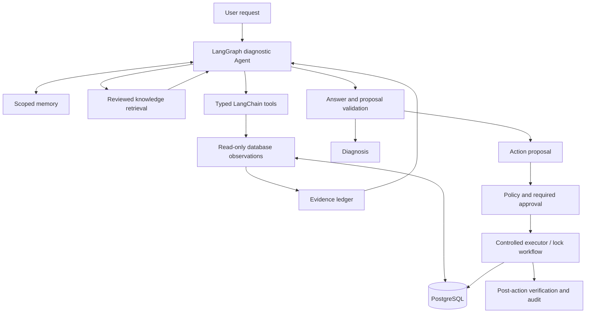

# SafeDBA

**Evidence-driven database diagnosis and controlled operations for PostgreSQL.**

SafeDBA combines a language-model Agent with a deterministic database control
plane. The Agent investigates incidents, retrieves relevant knowledge and
produces evidence-backed recommendations. SafeDBA validates proposals, enforces
approval requirements, executes permitted operations and verifies their results.

LangGraph manages the diagnostic workflow. LangChain provides the model and tool
interfaces. Database authority stays with SafeDBA's policy and execution layers.

[Quick Start](#quick-start) · [Usage](#usage) · [Knowledge Retrieval](#knowledge-retrieval-rag) · [Documentation](#documentation)

## Features

- **Database diagnosis** — execution plans, indexes, column statistics,
  cardinality anomalies and non-sargable predicates.
- **Operational visibility** — connection capacity, active sessions, open
  transactions, lock relationships, VACUUM pressure, replication and
  PostgreSQL-visible storage usage.
- **Controlled remediation** — structured proposals for index creation, query
  rewrite evaluation, statistics maintenance and blocker termination.
- **Durable lock workflows** — review multiple blockers as one incident, execute
  within the approved scope and reconcile interrupted work.
- **Reviewed knowledge retrieval** — consult internal runbooks and business
  definitions with source citations, expiry and deployment-scope filtering.
- **Persistent context** — scoped conversation history and incident summaries,
  with reviewed experience export for offline evaluation.
- **Execution isolation** — a separate lock worker with short-lived, single-use
  operator grants and identity-bound execution.
- **Operational controls** — bounded tool use, model circuit breaking, redacted
  audit records, live deny controls and optional OpenTelemetry tracing.

## Architecture



The model cannot issue arbitrary database mutations. Tool arguments, evidence
freshness, target identities and execution policy are checked independently of
model instructions. Reference documents and historical memory do not authorize
actions.

The diagnostic graph runs bounded model, serial-tool and answer-validation
steps. Durable lock recovery is managed by `IncidentWorkflow`, separately from
the diagnostic graph.

## Quick Start

### Requirements

- Python 3.10 or newer.
- Docker with Docker Compose for the included PostgreSQL environment.
- Access to a tool-calling language model supported by the configured provider.

### 1. Install

```shell
git clone https://github.com/IsIllusion/SafeDBA.git
cd SafeDBA
python -m venv .venv
```

Windows PowerShell:

```powershell
.\.venv\Scripts\Activate.ps1
python -m pip install -r requirements.txt
Copy-Item .env.example .env
```

Linux or macOS:

```bash
source .venv/bin/activate
python -m pip install -r requirements.txt
cp .env.example .env
```

### 2. Configure the model

Set the provider credentials in your local configuration. For the included
DeepSeek configuration:

```dotenv
SAFEDBA_LLM_PROVIDER=deepseek
SAFEDBA_LLM_MODEL=deepseek-v4-flash
SAFEDBA_LLM_API_KEY=YOUR_API_KEY
SAFEDBA_LLM_REASONING_ENABLED=false
```

For another compatible endpoint, set `SAFEDBA_LLM_PROVIDER=openai_compatible`
and provide `SAFEDBA_LLM_BASE_URL`, `SAFEDBA_LLM_MODEL` and
`SAFEDBA_LLM_API_KEY`. Applications can also inject a native LangChain chat
model through the [Python integration interface](docs/LANGGRAPH_MIGRATION.md#model-integration).

### 3. Start PostgreSQL

```shell
docker compose up -d
docker compose ps
```

The included stack runs PostgreSQL 16 on `127.0.0.1:15432` and provisions separate
observation, maintenance and termination identities. The defaults in
[.env.example](.env.example) match this local environment. Use separately
provisioned roles and credentials when connecting another database.

### 4. Run a diagnosis

```shell
python src/main.py "Investigate current database health and lock waits. Diagnosis only."
```

Run `python src/main.py` without arguments to start an interactive session.
Model-backed requests use the configured provider and may incur API charges.

## Usage

### Diagnose a query

```shell
python src/main.py "Inspect the estimated plan for SELECT id FROM public.orders WHERE id = 1. Do not execute the query."
```

Diagnosis is the default mode. It does not enable action proposals. In
development, permitted diagnostics can use bounded `EXPLAIN ANALYZE`, which
executes a read-only query; use estimated plans when execution is not intended.

### Request an action proposal

```shell
python src/main.py --propose "Investigate this database and propose an action only if the evidence justifies it."
```

| Operation | Risk | Required controls |
|---|---|---|
| Query rewrite evaluation | Low | Explicit proposal mode, query checks and result comparison |
| Create index | Medium | Explicit approval, evidence validation and before/after measurement |
| Analyze table | Medium | Explicit approval and statistics verification |
| Terminate blocking backend | High | Exact identity binding, fresh lock evidence and explicit approval |

Proposal mode is not blanket execution approval. Runtime policy may prohibit an
operation even when a proposal is valid.

### Resolve a lock incident

```shell
python src/main.py --resolve-locks "Investigate and resolve the current lock incident."
python src/main.py --incidents
python src/main.py --resume <incident-id>
```

`IncidentWorkflow` groups observed blockers into a durable, exact-scope plan.
One workflow approval can cover multiple blockers; each action receives fresh
validation before execution. Changed targets, expired approvals and uncertain
outcomes follow explicit reapproval or reconciliation paths.

The independent-worker profile additionally requires an operator-side grant.
Completed actions are not automatically repeated on resume. See the
[execution and recovery guide](docs/ISOLATED_EXECUTOR.md).

### Continue a session

```shell
python src/main.py --session incident-42 --thread operations "Continue the earlier investigation using fresh database evidence."
```

Session history and episodic memory are stored in SQLite. Historical context
cannot replace current observations or satisfy action prerequisites.

Interactive commands include `/propose`, `/resolve-locks`, `/incidents`,
`/resume`, `/session`, `/forget` and `/feedback`. Reviewed experience records
can be exported through `src/learning_cli.py`; this process does not train or
deploy models automatically.

## Knowledge Retrieval (RAG)

SafeDBA retrieves operator-reviewed runbooks, service ownership, business
dictionaries, maintenance windows and incident reference material. The local
retriever uses English/CJK lexical BM25 ranking and requires no embedding
service or vector database.

- Documents carry source, revision, review time, expiry and deployment metadata.
- Scope, environment, PostgreSQL version and validity filters run before ranking.
- Knowledge uses `kb-...` citations, separate from database evidence `ev-...`.
- Explicit internal-knowledge requests receive a budgeted initial lookup.
- Mixed requests retain their requirement for current database observations.
- Missing or inapplicable documents are not valid sources or execution authority.

Retrieval is disabled by default. Publish your reviewed content and configure its
scope before enabling it. The repository includes a publication template and
synthetic evaluation fixtures; it does not ship organization-specific policies.

Follow the [knowledge publication and configuration guide](docs/KNOWLEDGE_RETRIEVAL.md).
Citation validation checks delivered, applicable sources; it does not prove
every natural-language claim in an answer.

## Deployment and Operations

SafeDBA separates diagnosis, proposal and execution policy. With
`SAFEDBA_ENV=production`, runtime query analysis and benchmark-based
index/statistics/rewrite workflows are prohibited. Database mutations are
disabled by default; lock termination requires explicit enablement and all
existing approval and identity checks.

The `combined` profile keeps execution in the local application. The
`agent` and `executor` profiles separate model/observer credentials from
termination credentials. Deploy them with distinct OS identities and protected
code, secrets, grants and state; process separation alone is not a sandbox.

```shell
python src/main.py --runtime-policy
python src/main.py --verify-audit
```

Runtime controls can deny subsequent operations without granting additional
permissions. Audit records use redaction and a verifiable local hash chain;
OpenTelemetry exports bounded operational metadata when enabled. Deployments
remain responsible for state backups, access control and external audit retention.

See the [operations guide](docs/OPERATIONS.md) for role provisioning, environment
policies, stop controls, audit handling and observability.

## Development and Testing

```shell
python -m unittest discover -s tests -v
python src/knowledge_evaluate.py
```

The suite contains **449 portable tests** and **21 opt-in PostgreSQL integration
tests**. Database integration tests skip unless an explicit test environment is
configured. The default suite does not require a live language model.

Run the integration suite against a new disposable PostgreSQL instance:

```powershell
python scripts/run_postgres_integration.py --pg-bin "C:\Program Files\PostgreSQL\18\bin" --repeat 3
```

The runner creates its own cluster and isolated credentials, then stops and
removes the cluster after testing. It does not use the configured business
database. On Unix, supply the PostgreSQL binary directory and run as a non-root
user.

CI is configured for Windows/Linux with Python 3.10/3.12 and PostgreSQL 16/18
integration jobs. Coverage includes framework compatibility, observation
contracts, SQL policy, RAG, multi-lock approval and cross-process recovery.

Real-model evaluation is available through the documented opt-in runners.
Methods, results and limitations are kept in the evaluation reports linked below.

## Project Structure

```text
src/
  agent*.py              Agent interface, graph runtime, tools and context
  langchain_bridge.py    Model and tool interoperability
  db_tools.py            Database facade, connection policy and controlled operations
  db_catalog.py          Catalog and column-statistics observations
  db_operational.py      Health, capacity, replication and storage observations
  db_sessions.py         Session and lock-graph observations
  knowledge*.py          Reviewed knowledge publication, retrieval and evaluation
  incident*.py           Durable lock planning and approval
  execution*.py          Independent worker protocol, client and grants
  executor*.py           Controlled execution and worker entry point
  workflow_store.py      Durable incident state
  experience_store.py    Reviewed feedback and dataset records
  audit.py               Redacted audit chain
  telemetry.py           Operational tracing
tests/                   Portable, protocol and real-database tests
docs/                    Architecture, deployment and evaluation guides
benchmarks/              Diagnosis and retrieval evaluation fixtures
scripts/                 Disposable test runners and manual diagnostics
sql/                     Local PostgreSQL initialization
```

Module ownership and compatibility checks are described in the
[maintenance guide](docs/CODE_STRUCTURE.md).

## Documentation

| Guide | Contents |
|---|---|
| [Architecture and maintenance](docs/CODE_STRUCTURE.md) | Module boundaries, dependency composition and refactor contracts |
| [LangGraph and LangChain integration](docs/LANGGRAPH_MIGRATION.md) | Python API, model injection and graph behavior |
| [Operations](docs/OPERATIONS.md) | Database roles, runtime controls, audit and deployment policy |
| [Independent executor](docs/ISOLATED_EXECUTOR.md) | Worker isolation, grants and recovery |
| [Knowledge retrieval](docs/KNOWLEDGE_RETRIEVAL.md) | Reviewed content, publication, scope and retrieval |
| [Real-model evaluation](docs/LIVE_MODEL_EVALUATION.md) | Database-backed evaluation methodology and results |
| [RAG evaluation](docs/RAG_AB_EVALUATION.md) | Paired evaluation design and baseline findings |
| [RAG verification](docs/RAG_REPAIR_VERIFICATION.md) | Reliability improvements and regression results |
| [Changelog](CHANGELOG.md) | Implemented changes and verification history |

## License

[MIT](LICENSE)
