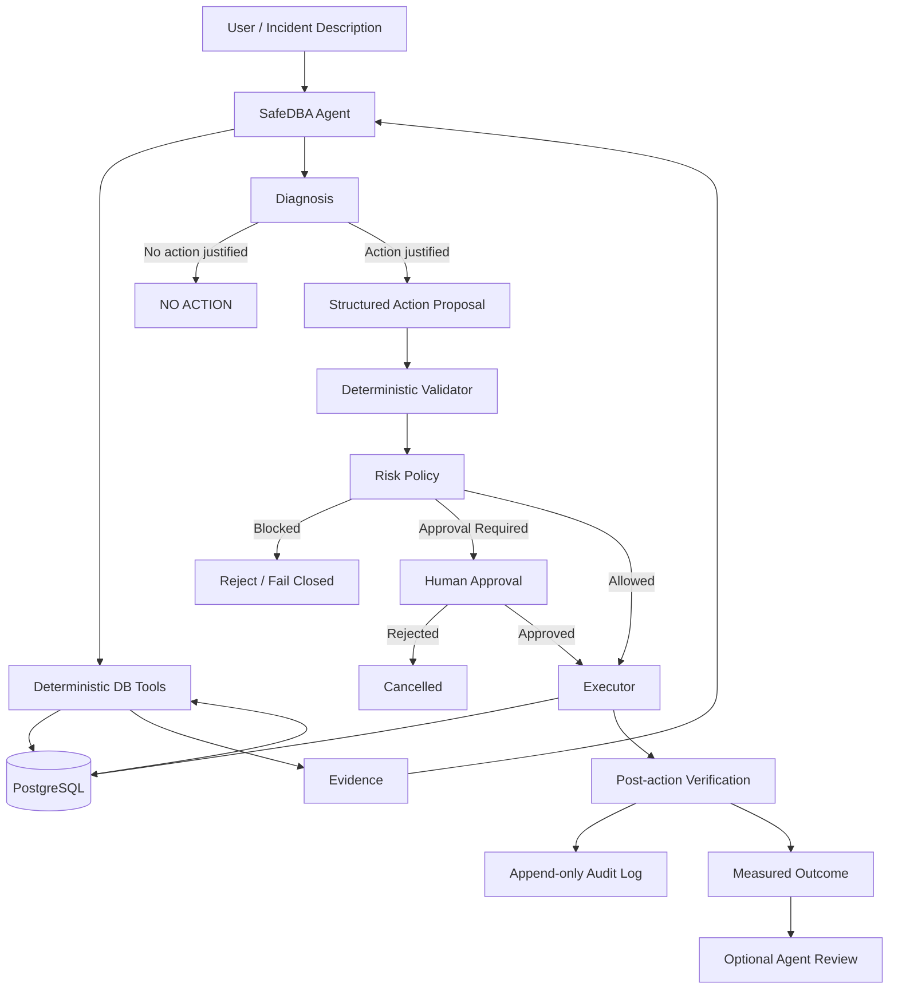

# SafeDBA

**Evidence-grounded, safety-aware Agentic DBA for PostgreSQL**

SafeDBA is an experimental Agentic Database Administration system that
investigates PostgreSQL performance and operational incidents using
real database evidence, while keeping database modification authority
outside the LLM.

The core design principle is:

> **The LLM decides what to investigate. Deterministic tools establish
> facts. A deterministic safety layer owns execution authority.**

SafeDBA is currently designed as a portfolio / research prototype rather
than a production-ready autonomous DBA.

---

## Why SafeDBA?

LLMs can reason about SQL and database operations, but directly giving
a generative model unrestricted database authority creates obvious
reliability and safety problems.

SafeDBA separates reasoning from execution:

```text
Natural-language incident
        |
        v
LLM investigation routing
        |
        v
Deterministic PostgreSQL evidence tools
        |
        v
Evidence-grounded diagnosis
        |
        v
Structured action proposal
        |
        v
Deterministic validation + risk policy
        |
        v
Human approval when required
        |
        v
Controlled executor
        |
        v
Post-action verification
        |
        v
Append-only audit log
```

The Agent can investigate and recommend actions, but it does not have
direct authority to modify the database.

---

## Architecture



---


## Demo Scenarios

SafeDBA is designed to distinguish between situations that require
optimization, situations that require maintenance, and situations where
the safest decision is to take no action.

The following scenarios illustrate that behavior.

### Demo 1 — Correctly Refusing an Unnecessary Optimization

**Incident**

```sql
SELECT *
FROM orders
WHERE id > 0;
```

PostgreSQL chooses a Sequential Scan even though the table already has
a primary-key B-tree index on `id`.

A naive SQL-optimization agent might treat the Sequential Scan itself as
a problem and recommend another index.

SafeDBA instead collects execution evidence:

```text
Scan type:            Sequential Scan
Rows examined:        1,000,000
Rows returned:        1,000,000
Rows removed:         0
Selectivity:          1.0
Cardinality error:    1.0
```

Because the query returns effectively the entire table, the Sequential
Scan is appropriate.

SafeDBA therefore produces:

```text
Diagnosis:
The predicate is non-selective and the Sequential Scan is appropriate.

Action:
NO_ACTION
```

No index, rewrite, or statistics-maintenance proposal is submitted.

This scenario is included in the regression benchmark and passed all
three runs without a false-positive optimization.

---

### Demo 2 — Stale Statistics Instead of a Missing Index

**Incident**

```sql
SELECT *
FROM cardinality_test
WHERE status = 'hot';
```

Runtime evidence shows:

```text
Rows examined:               100,000
Rows returned:                50,000
Planner estimated rows:            1
Cardinality error ratio:      50,000x
Predicate selectivity:             0.5
```

The query uses a Sequential Scan, but the scan itself is not the main
problem: returning 50% of the table makes a Sequential Scan reasonable.

SafeDBA inspects PostgreSQL statistics and finds that the planner
statistics describe a distribution that no longer matches the observed
data.

The resulting diagnosis is:

```text
Root cause:
Severely stale planner statistics.

Rejected alternatives:
CREATE_INDEX
REWRITE_QUERY

Structured proposal:
ANALYZE_TABLE
```

The expected outcome is improved cardinality estimation, not
necessarily a different scan type or lower latency.

This distinction matters because SafeDBA evaluates the operation against
an action-specific acceptance criterion instead of assuming that every
database intervention must make the query faster.

This scenario also passed all three runs in the current regression
benchmark.

---

### Demo 3 — Lock Contention RCA with Controlled Remediation

SafeDBA can also investigate operational incidents without starting from
a predefined SQL optimization case.

For a PostgreSQL blocking scenario, the Agent can collect deterministic
runtime evidence such as:

```text
blocked backend
        |
        | pg_blocking_pids()
        v
blocking backend

+ session state
+ wait event
+ transaction age
+ blocked SQL
+ blocker SQL
+ waiting-lock evidence
```

A typical diagnosis may identify an idle-in-transaction client backend
that is currently blocking another backend waiting on a lock.

SafeDBA does not give the LLM direct permission to terminate that
session.

Instead, remediation follows this path:

```text
Agent investigation
        |
        v
Current lock evidence
        |
        v
Structured TERMINATE_BACKEND proposal
        |
        v
Deterministic validation
        |
        v
HIGH-risk classification
        |
        v
Human approval
        |
        v
Execution-time revalidation
        |
        v
pg_terminate_backend(...)
        |
        v
Post-action lock verification
        |
        v
Append-only audit record
```

The executor rechecks that the blocking relationship still exists before
attempting termination. This reduces the risk of acting on stale Agent
evidence.

After execution, SafeDBA verifies whether the original blocking
relationship has disappeared rather than treating a successful API call
as proof that the incident was resolved.

Backend termination remains a deliberately narrow, human-approved,
HIGH-risk operation.

> This lock-contention flow is currently exercised through manual
> integration / end-to-end verification scripts and is not part of the
> four-scenario automated regression benchmark above.

---

### What These Scenarios Demonstrate

The goal is not simply to make an LLM produce DBA recommendations.

The scenarios exercise three different decisions:

| Scenario | Correct System Behavior |
|---|---|
| Broad predicate / correct Seq Scan | Refuse unnecessary optimization |
| Severe stale-statistics error | Propose targeted statistics maintenance |
| Runtime lock contention | Perform RCA and gate remediation behind safety controls |

Together they demonstrate the separation between:

```text
probabilistic investigation
        and
deterministic execution authority
```


## Core Capabilities

### 1. SQL Performance Diagnosis

SafeDBA can inspect read-only PostgreSQL queries using deterministic
execution-plan evidence.

Current diagnostic capabilities include:

- Sequential Scan analysis
- Index usage inspection
- Selectivity analysis
- Rows examined vs. rows returned
- PostgreSQL buffer evidence
- Cardinality-estimation error
- Parallel scan handling
- Missing-index diagnosis
- Non-sargable predicate detection
- Statistics-related planner anomalies

SafeDBA does **not** assume that every Sequential Scan is a problem.

For example, a full-table query with very low filtering selectivity may
correctly use a Sequential Scan even when an index exists.

---

### 2. Query Rewrite Evaluation

SafeDBA may propose a SQL rewrite when database evidence indicates that
a non-sargable predicate prevents effective index use.

A proposed rewrite is not automatically considered correct.

The deterministic executor can validate:

1. result-set equivalence
2. execution behavior
3. measured performance

before treating the rewrite hypothesis as supported.

---

### 3. Statistics and Cardinality Diagnosis

SafeDBA can investigate severe PostgreSQL planner-estimation errors and
inspect column/table statistics.

When stale or insufficient statistics are strongly supported by
evidence, the Agent may propose an `ANALYZE_TABLE` action.

The effect of `ANALYZE` is verified using planner-estimation evidence;
it is not assumed that scan type or latency must improve.

---

### 4. General Incident Mode

SafeDBA also accepts operational descriptions without requiring the
user to provide a specific SQL statement.

Example:

```text
The database feels slow and some work may be stuck.
Investigate using current database evidence.
Diagnosis only.
```

The Agent can route its investigation through runtime evidence such as:

- database health snapshot
- active client sessions
- long-running queries
- open / idle transactions
- lock waits
- blocked-to-blocker relationships

This allows SafeDBA to move beyond SQL optimization into database
operations RCA.

---

### 5. Lock Contention RCA

SafeDBA can use PostgreSQL runtime state to identify:

- blocked backend PID
- blocker backend PID
- blocked SQL
- blocker SQL
- wait event
- transaction age
- session state
- waiting lock evidence

The system distinguishes deterministic evidence from inference.

For example:

- `ClientRead` on an idle-in-transaction blocker means the backend is
  waiting for client activity.
- It does not mean the blocker itself is waiting on a database lock.
- A point-in-time blocking snapshot is not automatically described as
  a deadlock.
- Lock ownership is not claimed unless deterministic evidence supports
  that ownership.

---

## Controlled Remediation

SafeDBA separates action proposals from execution.

Current action types include:

```text
CREATE_INDEX
REWRITE_QUERY
ANALYZE_TABLE
TERMINATE_BACKEND
```

Each proposal passes through deterministic validation before execution.

---

## Safety Model

SafeDBA treats database operations according to explicit risk policy.

Examples:

| Operation | Risk |
|---|---|
| SELECT / EXPLAIN | LOW |
| REWRITE_QUERY | LOW |
| CREATE_INDEX | MEDIUM |
| ANALYZE_TABLE | MEDIUM |
| TERMINATE_BACKEND | HIGH |
| DROP_TABLE | CRITICAL |

Unknown operations fail closed as `CRITICAL`.

Medium- and high-risk actions require explicit approval according to the
current policy.

### Backend Termination

Backend termination is intentionally narrow.

The current controlled termination path is intended for cases where
deterministic runtime evidence confirms conditions such as:

- a current blocked-to-blocker relationship exists
- the blocked backend is waiting on a lock
- the blocker is a PostgreSQL client backend
- the blocker belongs to the configured database
- the blocker is idle in transaction
- the target is not the executor's own backend
- human approval is provided

Runtime state is revalidated immediately before the termination attempt.

Termination is a **HIGH-risk** action and is not treated as autonomous
background remediation.

---

## Post-Action Verification

Execution success is not inferred merely because a command was issued.

SafeDBA verifies outcomes according to the action type.

Examples include:

- query rewrite semantic equivalence
- measured query-performance comparison
- execution-plan changes
- cardinality-estimation changes after `ANALYZE`
- blocking relationship removal after backend termination

The deterministic result remains authoritative even if the optional
LLM post-action explanation fails.

---

## Audit

Controlled actions are recorded in an append-only JSONL audit log.

Audit records may include:

- operation ID
- timestamp
- action type
- risk level
- approval state
- deterministic decision
- proposal
- before-state evidence
- execution evidence
- post-action verification evidence

Default location:

```text
logs/audit.jsonl
```

The `logs/` directory is excluded from Git.

---

## LLM Provider Layer

SafeDBA keeps provider-specific request behavior outside the Agent.

Current provider modes:

```text
deepseek
openai_compatible
```

DeepSeek-specific thinking configuration is handled by the provider
adapter rather than being hard-coded into Agent logic.

Generic OpenAI-compatible endpoints may be used for standard Chat
Completions-style requests, but provider-specific reasoning semantics
are intentionally not assumed to be portable across vendors.

---

## Project Structure

```text
SafeDBA/
|
|-- src/
|   |-- main.py
|   |-- agent.py
|   |-- llm_provider.py
|   |-- db_tools.py
|   |-- diagnostics.py
|   |-- actions.py
|   |-- safety.py
|   |-- executor.py
|   |-- audit.py
|   |-- config.py
|   `-- evaluate.py
|
|-- benchmarks/
|   |-- cases/
|   |   |-- case_001_missing_index.json
|   |   |-- case_002_non_sargable.json
|   |   |-- case_003_seq_scan_correct.json
|   |   `-- case_004_stale_statistics.json
|   |
|   `-- results/
|       `-- latest_evaluation.json
|
|-- scripts/
|   `-- manual/
|       |-- README.md
|       |-- verify_analyze_executor.py
|       |-- verify_lock_agent.py
|       |-- verify_lock_end_to_end.py
|       |-- verify_lock_waits.py
|       |-- verify_rewrite_executor.py
|       |-- verify_rewrite_validation.py
|       |-- verify_terminate_executor.py
|       `-- verify_terminate_proposal.py
|
|-- sql/
|   `-- init.sql
|
|-- .env.example
|-- .gitignore
|-- docker-compose.yml
|-- requirements.txt
`-- README.md
```

---

## Requirements

- Python 3.10+
- Docker / Docker Compose
- PostgreSQL demo environment
- An LLM API key

Python dependencies:

```text
openai
psycopg[binary]
python-dotenv
```

---

## Quick Start

### 1. Clone the repository

```powershell
git clone <repository-url>
cd SafeDBA
```

### 2. Create a virtual environment

```powershell
python -m venv .venv
.\.venv\Scripts\Activate.ps1
```

### 3. Install dependencies

```powershell
python -m pip install -r requirements.txt
```

### 4. Create local configuration

```powershell
Copy-Item .env.example .env
```

Edit `.env` and configure your LLM API key.

For DeepSeek, for example:

```dotenv
SAFEDBA_LLM_PROVIDER=deepseek
SAFEDBA_LLM_MODEL=deepseek-v4-flash
SAFEDBA_LLM_REASONING_ENABLED=false

DEEPSEEK_API_KEY=YOUR_API_KEY
```

Do **not** commit `.env`.

### 5. Start PostgreSQL

```powershell
docker compose up -d
```

Check the container:

```powershell
docker compose ps
```

### 6. Run SafeDBA

```powershell
python src/main.py
```

Then describe a database problem:

```text
SafeDBA> Analyze this query for performance:
SELECT * FROM orders WHERE id > 0;
```

Or use General Incident Mode:

```text
SafeDBA> The database feels slow and some work may be stuck.
Investigate using current database evidence. Diagnosis only.
```

---

## Manual Verification Scripts

The repository contains manual integration and safety verification
scripts under:

```text
scripts/manual/
```

These are **not ordinary unit tests**.

Some scripts require:

- a running PostgreSQL instance
- prepared database state
- concurrent PostgreSQL sessions
- a real LLM API
- explicit human approval

Some scripts exercise controlled database actions.

Do not run manual verification scripts against a production database.

From PowerShell:

```powershell
$env:PYTHONPATH="$PWD\src"
python scripts\manual\verify_lock_waits.py
```

See:

```text
scripts/manual/README.md
```

for details.

---

## Regression Benchmark

The current benchmark suite contains scenarios for:

1. missing-index diagnosis
2. non-sargable predicate diagnosis / rewrite proposal
3. correct Sequential Scan / no-action behavior
4. stale statistics / cardinality-estimation diagnosis

### Current Evaluation Snapshot

The current regression checkpoint contains:

| Metric | Result |
|---|---:|
| Scenarios | 4 |
| Runs per scenario | 3 |
| Total runs | 12 |
| Passed runs | 12 / 12 |
| Decision pass rate | 100% |
| Evidence-fidelity pass rate | 100% |
| False-positive optimizations | 0 |

The four scenarios cover:

1. selective predicate with a missing index
2. non-sargable predicate with an existing supporting index
3. appropriate Sequential Scan requiring no optimization
4. stale statistics causing severe cardinality under-estimation

These results describe only the current controlled regression suite.
They are **not** a claim of universal database-diagnosis accuracy or
production reliability.

Cases are stored under:

```text
benchmarks/cases/
```

The current evaluation output is stored under:

```text
benchmarks/results/latest_evaluation.json
```

The benchmark is intended as a regression suite for known scenarios,
not as a claim of universal DBA reliability.

---

## Important Safety Limitations

SafeDBA is currently a prototype.

Known limitations include:

- The read-only SQL guard is intentionally simple and currently focuses
  on SELECT statements.
- `EXPLAIN ANALYZE` executes the query being analyzed.
- Query-analysis tools should therefore only be used on appropriate
  read-only SQL.
- The project does not currently provide a complete production-grade
  SQL parser / policy engine.
- Runtime observations are point-in-time snapshots.
- `CREATE INDEX` behavior is not yet designed as a complete
  production-online index-management system.
- Backend termination has no application-level compensating rollback.
- High-risk operations are intentionally human-controlled.
- The system does not claim complete database health visibility from
  the current runtime evidence tools.
- Provider-specific reasoning behavior is not assumed to be portable
  across every OpenAI-compatible endpoint.

Do not use SafeDBA against production systems without additional
security, policy, observability, timeout, permissions, and operational
controls.

---

## Design Philosophy

SafeDBA is not intended to demonstrate that an LLM can simply
"optimize SQL."

The project focuses on a broader engineering problem:

> **How can a generative model participate in database operations while
> remaining bounded by deterministic evidence, explicit risk policy,
> human approval, execution-time validation, post-action verification,
> and auditability?**

That separation between probabilistic reasoning and deterministic
execution authority is the central design goal of SafeDBA.

---

## Roadmap

Planned improvements include:

- automated unit tests
- automated integration-test fixtures
- General Incident Mode regression evaluation
- stronger SQL read-only enforcement
- database statement and lock timeout policies
- improved production-safe index workflows
- additional PostgreSQL operational RCA tools
- richer evaluation of evidence fidelity
- CI with GitHub Actions
- provider-specific adapters where justified

---

## License

This project is licensed under the MIT License.

See [LICENSE](LICENSE) for details.

## Disclaimer

SafeDBA is an educational, experimental, and portfolio project.

It is not a replacement for professional database administration,
production change-management procedures, or database-specific
operational safeguards.