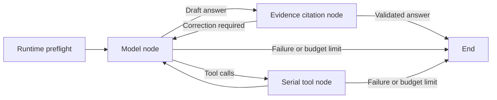

# LangGraph and LangChain Integration

SafeDBA uses LangGraph for bounded diagnostic orchestration and LangChain for
model and tool interfaces. The deterministic database control plane remains
responsible for evidence validation, approvals, execution, and recovery.

## Migration boundaries

| Responsibility | Implementation |
|---|---|
| Model/tool/answer transitions | `src/agent_graph.py`: compiled LangGraph `StateGraph` |
| Public API and integration composition | `src/agent.py` and `src/agent_dependencies.py` |
| Diagnostic nodes and run lifecycle | `src/agent_runtime.py`, `src/agent_tool_execution.py`, and `src/agent_context.py` |
| Model interoperability | `src/langchain_bridge.py`: `BaseChatModel`, native `AIMessage` history, and a compatible-provider adapter |
| Tool invocation | LangChain `StructuredTool` wrappers built from the existing immutable registry schemas; optional run-local knowledge tool |
| Evidence and proposal authorization | Existing `EvidenceLedger`, mode filters, freshness checks, and schema validation |
| Memory and incident durability | Existing SQLite stores, unchanged schemas and approval semantics |
| Database mutations | Existing controlled executors and optional independent lock worker |

The former model/tool `for` loop is replaced by graph transitions. There is no
alternate legacy execution engine in application code. A frozen pre-migration
loop from commit `415486aa74fcc791a140c364f8d21cc06e548d68` exists only as a
differential-test reference under `tests/fixtures/`.



Graph state records the iteration, conversation snapshot, usage, evidence
references, next route, and terminal result. Run-local callbacks retain the
evidence ledger and memory/telemetry handles. Database connections, worker
grants, and execution authority are not serialized into graph state.

## Model integration

Existing callers and CLI configuration continue to work. With `src` on the
Python import path:

```python
from agent import run_agent

result = run_agent("Investigate database health. Diagnosis only.")
```

The configured DeepSeek/OpenAI-compatible provider runs through
`ProviderChatModel`, a LangChain `BaseChatModel` adapter. Existing timeouts,
token limits, reasoning configuration, circuit breaking, fallback metadata,
and bounded-evaluation accounting remain in the provider layer.

Applications can instead inject a native LangChain chat model:

```python
import os
from langchain_openai import ChatOpenAI
from agent import run_agent, review_execution_result

# Supply these variables explicitly for the chosen compatible endpoint.
model = ChatOpenAI(
    model=os.environ["SAFEDBA_LLM_MODEL"],
    api_key=os.environ["SAFEDBA_LLM_API_KEY"],
    base_url=os.environ["SAFEDBA_LLM_BASE_URL"],
    timeout=20,
    max_retries=0,
    max_tokens=1500,
    use_responses_api=False,
)

result = run_agent(
    "Investigate database health. Diagnosis only.",
    chat_model=model,
    mode="diagnose",
    max_iterations=8,
)
```

`chat_model` must implement `BaseChatModel` and tool binding. Do not pass both
`provider` and `chat_model`. `review_execution_result(..., chat_model=model)`
uses the same optional interface, without tools. Native-model injection does
not automatically inherit the configured provider's fallback policy: configure
the supplied model's transport timeout and retry behavior explicitly.

Other LangChain provider packages can be installed by the integrating
application. SafeDBA accepts text responses and supported text/reasoning/tool
content blocks; native messages, including signed reasoning blocks, are retained
for subsequent model turns. Unsupported blocks and ambiguous tool-call ordering
fail closed. This contract does not imply that every vendor integration or model
has been tested against a live endpoint.

The return structure remains unchanged: run/session identifiers, status, stop
reason, answer, proposals, tool/model traces, usage, memory status, and audit
correlation remain available to existing callers.

## Alignment controls

- Tool names, descriptions, JSON schemas, capability metadata, and serial
  dispatch order are retained. Framework argument coercion does not replace
  SafeDBA's validation.
- Malformed JSON, missing tool IDs/names, truncated responses, and inconsistent
  finish reasons cannot silently become valid tool calls.
- The compatible-provider path preserves original request dictionaries and
  response artifacts, including null content and `reasoning_content`.
- The native-model path retains original `AIMessage` instances in history;
  conversion to text is used for deterministic answer validation, not to strip
  provider-specific history. System instructions use one leading message for
  cross-provider compatibility; policy text and untrusted-memory delimiters are
  retained, and user/tool content is never promoted into system instructions.
- Per-turn and total tool budgets, deadlines, duplicate-call detection, proposal
  prerequisites, evidence freshness, and required answer citations remain
  enforced. Same-turn observations cannot authorize a proposal.
- Graph steps and model turns use separate limits. The graph limit accommodates
  all configured model turns, including evidence-citation repair turns.
- Conversation snapshots replace graph state explicitly. Messages are not
  merged by provider-assigned IDs, which may repeat across responses.
- No LangGraph node retries or parallel tool execution are enabled. Existing
  transport-level model retry policy is separate from database-action execution.

## Persistence and execution safety

No SQLite migration is required. Session memory remains untrusted historical
context; it cannot authorize an action or replace current database evidence.
Run-lifecycle checkpoints still record completed tool iterations.

The diagnostic graph has no LangGraph checkpointer and does not support
mid-node replay or LangGraph interrupt/resume. Durable lock recovery continues
through `IncidentWorkflow`, including exact-scope approval, execution leases,
single-use worker grants, and conservative reconciliation. Do not attach a
generic graph checkpointer and assume that replay authorizes a database action.

The graph and model facade disable automatic LangSmith tracing. Injected model
callbacks and model caching are disabled for the run; SafeDBA's existing
metadata-only OpenTelemetry integration remains available. This prevents
ambient framework configuration from exporting conversation/SQL payloads or
reusing cached diagnoses. Custom model implementations still own their internal
network behavior and must be trusted by the deploying application.

Knowledge retrieval is an optional additional tool, not a replacement graph or
evidence source. Disabled deployments retain the original tool/prompt/result
contracts. Enabled runs keep document citations separate from database evidence;
see [controlled retrieval](KNOWLEDGE_RETRIEVAL.md).

## Migration verification — 2026-09-08 (historical baseline)

The automated suite discovers **384 tests**: **365 portable tests** and **19
PostgreSQL integration tests**. Portable coverage includes:

- 42 modular-refactor checks against commit `d42113b`, covering exact contracts,
  dispatch, messages, persistence, pure grading and shared primitives. See the
  [module maintenance guide](CODE_STRUCTURE.md).
- 31 differential checks against the frozen legacy loop: outputs, available
  tools, actual dispatches, provider message batches, token usage, memory
  checkpoints, and failures. Only timing fields are excluded from comparisons.
- 19 LangChain contract checks, including the actual `ChatOpenAI` binding with
  an offline HTTP mock transport, native content blocks, raw malformed tool
  calls, reasoning history, schema equality, cache isolation, and tracing gates.
- Five graph-scheduler checks covering maximum model turns, correction routing,
  terminal results, no retry after node failure, and concurrent-run isolation.

Portable tests passed locally on Windows with Python **3.10.20** and
**3.12.14**; dependency consistency checks passed for both environments.
The Windows HTTP authorization test sends its small request frame in one write
to avoid a header/body delivery race with intentional early authentication
rejection; server authorization behavior is unchanged.

The PostgreSQL 18.4 suite passed all 19 cases in three consecutive final runs
with zero skips; the disposable server was stopped and its cluster removed.
It includes a native LangChain-model/LangGraph scenario
that observes three real blockers, builds three evidence-bound proposals,
confirms no pre-approval mutation, and resolves the exact batch under one
workflow approval. Existing independent-executor denial and crash/no-replay
tests run in the same suite. Tests use disposable instances and scripted model
outputs; no paid model requests are made.

```powershell
python -m pip install -r requirements.txt
python -m pip check
python -m unittest discover -s tests -v
python -m unittest discover -s tests -p "test_lang*.py" -v
python -m unittest discover -s tests -p "test_agent_graph.py" -v
python scripts/run_postgres_integration.py --pg-bin "C:\Program Files\PostgreSQL\18\bin" --repeat 3
```

Tested framework versions: LangChain **1.4.0**, LangChain Core **1.6.2**,
LangGraph **1.2.11**, and LangChain OpenAI **1.6.0**. Dependencies retain
major-version bounds in `requirements.txt`. CI also configures Linux and
PostgreSQL 16 coverage; local Windows results are not a claim about unobserved
CI runs.

The earlier [live-provider evaluation](LIVE_MODEL_EVALUATION.md) remains a
pre-migration baseline. Deterministic replay verifies software contracts, not
the accuracy of new stochastic model responses or production readiness.

## Framework references

- [LangGraph graph API](https://docs.langchain.com/oss/python/langgraph/graph-api)
- [LangChain chat models](https://docs.langchain.com/oss/python/langchain/models)
- [LangChain tools](https://docs.langchain.com/oss/python/langchain/tools)
- [ChatOpenAI integration](https://docs.langchain.com/oss/python/integrations/chat/openai)
- [ChatAnthropic content blocks](https://docs.langchain.com/oss/python/integrations/chat/anthropic)
